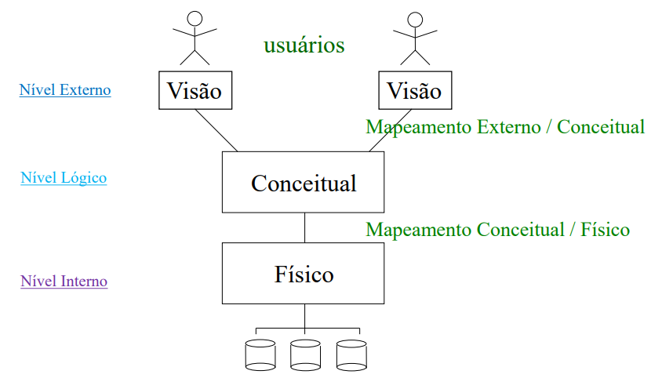

# Sistema de Banco de Dados

## Definição e Importância

Um **banco de dados (BD)** é uma coleção organizada de dados que serve a um propósito específico. Eles fornecem informações estruturadas e organizadas.

### Os Banco de Dados

- Possuem dados logicamente coerentes.
- São projetado para atender a um propósito específico.
- Reflete uma abstração do mundo real.
- Além dos dados, também armazena definições e descrições estruturais sobre os dados (metadados).

### Níveis de Abstração

Os bancos de dados utilizam três níveis de abstração para fornecer uma visão clara dos dados aos usuários:

|

### 1. **Nível Externo: Visão dos Dados para o Usuário**
No nível externo, o foco é na apresentação dos dados para diferentes usuários ou aplicativos. Aqui temos o resultado final, onde o usuário ou aplicativo vê tabelas, consultas e resultados.

Para ser mais claro, o usuário faz uma consulta em SQL buscar ou modificar dados, por exemplo:
    ```sql
    SELECT Título, Autor FROM Livros WHERE Categoria = 'Fantasia';
    ```

O Banco de Dados retorna os resultados da consulta, que são apresentados ao usuário como uma **Tabela**.

    | **Título**        | **Autor**       | **Categoria** | **Ano** |
    |-------------------|-----------------|---------------|---------|
    | O Hobbit          | J.R.R. Tolkien  | Fantasia      | 1937    |
    | Harry Potter      | J.K. Rowling    | Fantasia      | 1997    |


### 2. **Nível Conceitual: Estrutura Lógica Completa**
Esse é o nível que vamos começar a estudar , onde é definido a **estrutura completa dos dados** e seus relacionamentos, independentemente de como são fisicamente armazenados.

- **Exemplos de elementos neste nível:**
  - **Modelo Entidade-Relacionamento (MER)**: Aqui, você cria um modelo de como as entidades estão relacionadas, como "Livros", "Autores", "Categorias", etc. Após isso, você transforma o MER em um **Diagrama Entidade-Relacionamento (DER)**. Abaixo mostrarei um DER como exemplo, mas não se preocupe em entender ainda.
  
|[exemplo de DER](../assets/DER-exemplo.png)
  
  - **Modelo Lógico**: A partir do DER, você cria o **Modelo Lógico** que transforma as entidades e relacionamentos em tabelas:
    - Tabela "Livros" com colunas "Título", "AutorID", "CategoriaID", etc.
    - Tabela "Autores" com colunas "AutorID", "Nome".
  
  - **Definições SQL**:
    ```sql
    CREATE TABLE Livros (
      ID SERIAL PRIMARY KEY,
      Título VARCHAR(100),
      AutorID INT REFERENCES Autores(AutorID),
      CategoriaID INT REFERENCES Categorias(CategoriaID)
    );
    ```

### 3. **Nível Interno: Armazenamento Físico dos Dados**
Não nos aprofundaremos muito nesse nível, pois é onde os dados são armazenados fisicamente no disco. 

## Linguagem de Banco de Dados
Em Sistemas de Bancos de Dados, podemos fazer algumas operações e consultas. Elas são feitas por meio de linguagens, sendo a mais usada denominada SQL (Strutured
Query Language) em **Bancos de Dados Relacionais**;

Nesse material, estudaremos três tipos principais de linguagem SQL, que serão introduzidas afora, mas serão aprofundadas em seções futuras:

### DDL (Data Definition Language) - **Linguagem de Definição de Dados**
A **DDL** é usada para **criar, alterar ou apagar** a estrutura do banco de dados. Pense nela como o **construtor** e **modificador** da **estrutura do banco de dados**. Com ela, você define como as tabelas vão ser, quais colunas elas terão e suas características.

- **Exemplos de comandos DDL**:
  - **CREATE**: Cria novas tabelas, bancos de dados, índices, etc.
    ```sql
    CREATE TABLE Livros (
      ID INT PRIMARY KEY,
      Título VARCHAR(100),
      Autor VARCHAR(50)
    );
    ```
  - **ALTER**: Altera a estrutura de uma tabela existente.
    ```sql
    ALTER TABLE Livros ADD AnoPublicacao INT;
    ```
  - **DROP**: Apaga uma tabela ou banco de dados.
    ```sql
    DROP TABLE Livros;
    ```

### DML (Data Manipulation Language) - **Linguagem de Manipulação de Dados**
A **DML** é usada para **manipular os dados** dentro das tabelas. Isso inclui **inserir, atualizar, apagar e consultar** os dados. Pense nela como o "manipulador" dos dados.

- **Exemplos de comandos DML**:
  - **INSERT**: Insere novos registros em uma tabela.
    ```sql
    INSERT INTO Livros (ID, Título, Autor) VALUES (1, 'O Hobbit', 'J.R.R. Tolkien');
    ```
  - **UPDATE**: Atualiza registros existentes.
    ```sql
    UPDATE Livros SET Autor = 'J.R.R. Tolkien' WHERE ID = 1;
    ```
  - **DELETE**: Apaga registros específicos.
    ```sql
    DELETE FROM Livros WHERE ID = 1;
    ```

### DQL (Data Query Language) - **Linguagem de Consulta de Dados**
A **DQL** é usada para **consultar e obter informações** do banco de dados. O principal comando aqui é o **SELECT**. Pense nela como o "pesquisador" do banco, que faz perguntas para obter dados.

- **Exemplo de comando DQL**:
  - **SELECT**: Consulta dados de uma ou mais tabelas.
    ```sql
    SELECT Título, Autor FROM Livros WHERE Categoria = 'Fantasia';
    ```

### Resumo simples:
- **DDL:** Cria ou altera a estrutura do banco (construtor).
- **DML:** Manipula os dados dentro das tabelas (manipulador).
- **DQL:** Consulta os dados existentes (pesquisador).