# Modelo Entidade-Relacionamento (MER) e Diagrama Entidade-Relacionamento (DER)

O **Modelo Entidade-Relacionamento (MER)** é uma técnica de modelagem conceitual que auxilia na representação da estrutura de um banco de dados de forma intuitiva. Ele descreve como os dados se relacionam entre si no contexto do seu projeto, facilitando o planejamento das tabelas que irão armazenar essas informações. No MER, o foco é entender e representar os requisitos de informação sem se preocupar com detalhes de implementação, como tipos de dados específicos ou estruturas físicas de armazenamento.

## Diagrama Entidade-Relacionamento (DER)

O **Diagrama Entidade-Relacionamento (DER)** é a representação gráfica do MER. Ele facilita a visualização das **entidades**, seus **atributos** e os **relacionamentos** entre elas, permitindo uma compreensão mais clara de como os dados estão interconectados.

---

## Componentes de um MER e DER

### **Entidades**

As **entidades** são os objetos principais que serão armazenados no banco de dados. Elas representam um conjunto, coleção, conceito ou objeto do mundo real que desejamos guardar informações. Por exemplo, uma entidade chamada **Cliente** se tornará uma tabela **Cliente**, onde cada linha da tabela apresenta o registro de um cliente específico, e os atributos (como nome, e-mail, CPF) serão as colunas dessa tabela.

#### **Exemplos de Entidades:**

1. **Cliente**: Agrupa dados de clientes de uma loja ou empresa.
2. **Produto**: Representa os itens disponíveis para venda.
3. **Funcionário**: Representa os empregados de uma empresa.

#### **Dicas de Boas Práticas:**

- **Nomeação:**
  - Use nomes no **singular** para entidades e atributos.
  - Utilize **letras maiúsculas** para entidades e **letras minúsculas** para atributos.
  - Exemplo: "Cliente" em vez de "Clientes" ou "cliente"; "nome" em vez de "NOME" ou "nomes".

- **Clareza e Simplicidade:**
  - Escolha nomes significativos que reflitam claramente o que a entidade representa.
  - Evite abreviações ou siglas que possam gerar confusão.
  - Não coloque caracteres especiais ou espaços nos nomes.

#### **Representação Visual no DER:**

As entidades são representadas por **retângulos**, com o nome da entidade escrito dentro ou acima do retângulo.

| 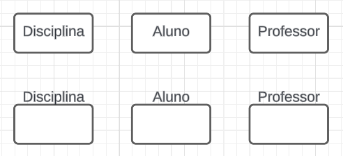 |

#### **Tipos de Entidades:**

##### **1. Entidades Fortes**

- **Descrição:** São entidades que possuem existência independente, ou seja, não dependem de outras entidades para existir. Elas possuem uma **chave primária própria** que as identifica unicamente.

- **Exemplos:**

  1. **Cliente**: Um cliente pode existir independentemente de outras entidades. Não importa se a loja tem produtos ou pedidos, ainda sim pode existir dados de clientes.
  2. **Produto**: Um produto tem sua própria identidade e não depende de outras entidades. Não precisa de clientes ou qualquer outra entidade para existir um produto.
  3. **Funcionário**: Um funcionário existe na empresa mesmo que não tenha clientes ou produtos associados.

- **Dicas de Boas Práticas:**

  - **Pergunta-chave:** "Essa entidade pode existir sozinha, sem depender de outra?" Se a resposta for "sim", ela é uma entidade forte.
  - **Consistência:** Certifique-se de que a entidade possui uma chave primária única.
  - **Simplicidade:** Evite entidades complexas que misturam múltiplos conceitos.
  - **Reutilização:** Considere reutilizar entidades existentes em vez de criar novas.
  - **Observação:** Na maioria dos casos, as entidades são fortes. Pode existir bancos com apenas entidades fortes.

- **Representação Visual no DER:**

  Entidades fortes são representadas por **retângulos simples**.

|  |

##### **2. Entidades Fracas**

- **Descrição:** São entidades que dependem de outra entidade (entidade forte) para existir. Elas não possuem uma chave primária própria suficiente para identificá-las unicamente no banco sem a chave da entidade forte.

- **Exemplos:**

  1. **Dependente**: Dependente de um funcionário, como filhos ou cônjuge. Não faz sentido existir um dependente sem um funcionário associado. O dependente é identificado pela combinação de **id_funcionário** e **nome**.
  2. **Turma**: Turmas que dependem de uma disciplina específica. Em uma universidade, se você diz que se matriculou na "Turma 1", vão perguntar "Turma 1 de que disciplina?". A turma é identificada pela combinação de **id_disciplina** e **número**. Repare que a Turma não tem uma identidade própria, ela depende da Disciplina.
  3. **Endereço**: Endereços podem depender de um cliente ou funcionário. Um endereço sozinho pode não ter utilidade no seu banco. Mas isso depende do contexto do seu sistema. Pode ser que em algum caso, o endereço seja uma entidade forte.

- **Dicas de Boas Práticas:**

  - **Pergunta-chave:** "Essa entidade depende de outra para existir?" Se a resposta for "sim", ela é uma entidade fraca.
  - **Chave Parcial:** Utilize um identificador parcial combinado com a chave primária da entidade forte, como **id_disciplina** e **número**.

- **Representação Visual no DER:**

  Entidades fracas são representadas por **retângulos com bordas duplas**.

| 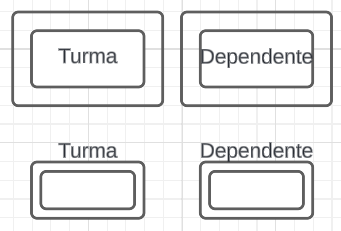 |

> **Nota Importante:** A decisão sobre uma entidade ser forte ou fraca depende do contexto e dos requisitos do sistema. Por exemplo, se em um projeto é necessário que a entidade **Turma** exista independentemente de uma **Disciplina**, então ela seria modelada como uma entidade forte.

##### **3. Entidades Associativas:** Falaremos sobre elas após aprendermos sobre **Relacionamentos** e **Cardinalidades**.

---

### **Atributos**

Os **atributos** são as características ou propriedades que descrevem uma entidade. Eles correspondem às colunas das tabelas no banco de dados. Também podem ser vistos como itens pertencentes a um conjunto.

#### **Tipos de Atributos:**

##### **1. Atributos Simples**

- **Descrição:** Não podem ser divididos em partes menores.

- **Exemplos:**

  1. **nome**: "Ana".
  2. **CPF**: "123.456.789-00".
  3. **email**: "ana@example.com".

- **Dicas de Boas Práticas:**

  - Use nomes claros e significativos.
  - Evite armazenar múltiplas informações em um único atributo simples.

- **Representação Visual no DER:**

  Representados por **elipses** conectadas à entidade.

| 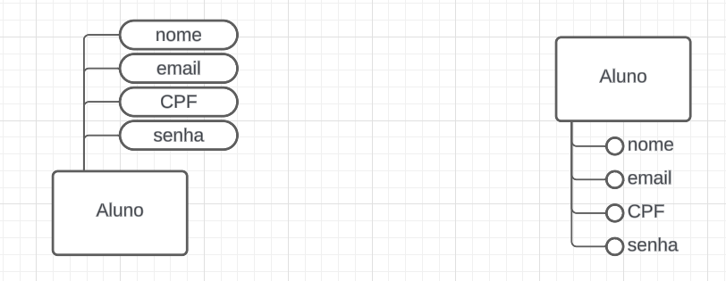 |

##### **2. Atributos Compostos**

- **Descrição:** Podem ser divididos em subpartes, cada uma com significado independente. Matematicamente, um atributo composto é um subconjunto de um conjunto maior.

- **Exemplos:**

  1. **endereço**, dividido em:
     - **rua**: "Avenida Paulista".
     - **número**: "1000".
     - **cidade**: "São Paulo".
     - **CEP**: "01311-000".
  2. **nomeCompleto**, dividido em:
     - **primeiroNome**: "Maria".
     - **sobrenome**: "Silva".
  3. **data**, dividido em:
     - **dia**: "15".
     - **mês**: "08".
     - **ano**: "2024".

- **Dicas de Boas Práticas:**

  - Avalie se as subpartes do atributo serão usadas separadamente no sistema.
  - Se as subpartes forem frequentemente utilizadas, considere armazená-las separadamente.
  
>**IMPORTANTE:** A decisão de manter um atributo composto ou separá-lo em atributos simples depende do contexto e das necessidades do sistema. No modelo lógico, um atributo composto é **dividido em vários atributos** na mesma tabela. Por exemplo, o atributo composto **endereço** se transforma em colunas como **rua**, **número**, **cidade** e **CEP** na tabela principal.

- **Representação Visual no DER:**

  Uma elipse principal conectada a subelipses.

| 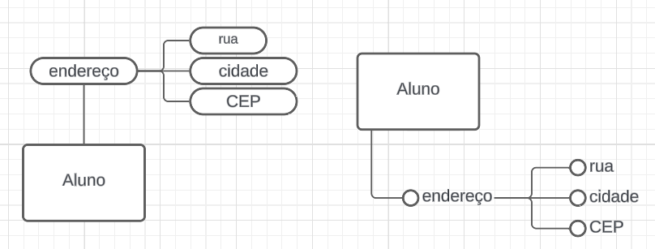 |

##### **3. Atributos Multivalorados**

- **Descrição:** Podem ter múltiplos valores para uma única entidade.

- **Exemplos:**

  1. **telefones**: "+55 61 9999-1111", "+55 82 8888-2222".
  2. **e-mailsAlternativos**: "ana@hotmail.com", "ana@yahoo.com".
  3. **habilidades**: "Java", "Python", "SQL".

**IMPORTANTE:** A decisão de como lidar com um atributo multivalorado depende do contexto e das necessidades do sistema. No modelo lógico, é recomendável **criar uma tabela separada** para armazenar esses valores múltiplos, associando-os por meio de uma **chave estrangeira**. Por exemplo, se um cliente pode ter **vários números de telefone**, é melhor criar uma tabela **Telefones** com colunas para **número** e a **referência ao cliente**. Isso evita armazenar vários valores em uma única coluna, o que tornaria a busca e a manipulação dos dados mais difíceis.

- **Representação Visual no DER:**

  Representados por **elipses com bordas duplas**.

| 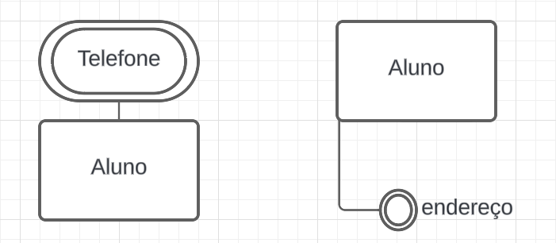 |

##### **4. Atributos Derivados**

- **Descrição:** Seu valor pode ser calculado a partir de outros atributos. Em alguns casos, é mais eficiente calcular o valor do que armazená-lo diretamente. Porém, existem casos em que é necessário armazenar o valor derivado para otimizar consultas, mas nesse caso esse atributo deixaria de ser derivado.

- **Exemplos:**

  1. **idade**, pode ser calculado a partir da **dataNascimento**.
  2. **saldo**, pode ser calculado a partir de **entradas** e **saídas** em uma conta.
  3. **duração**, pode ser calculado a partir da **dataInício** e **dataFim** de um projeto.

- **Dicas de Boas Práticas:**

  - Evite armazenar atributos derivados para não duplicar dados.
  - Calcule o valor quando necessário, garantindo dados atualizados.
  - Em alguns casos, pode ser que o cálculo do atributo derivado seja complexo e demorado, o que justifica armazenar o valor, mas isso faz com que o banco não siga a 3ª forma normal.

**IMPORTANTE:** Atributos derivados são calculados a partir de outros atributos e, por isso, em grande parte das vezes **não devem ser armazenados diretamente** no banco de dados, apenas aparecem no Modelo Entidade Relacionamento. Em vez disso, seu valor é gerado dinamicamente com base em uma fórmula ou cálculo. Por exemplo, a **idade** de uma pessoa pode ser derivada a partir de sua **data de nascimento**. Armazenar atributos derivados como colunas fixas pode causar inconsistências e duplicações, além de ocupar espaço desnecessário. Mas vale lembrar: ***DEPENDE DO CONTEXTO E DO QUE O SISTEMA PRECISA***

- **Representação Visual no DER:**

  Representados por **elipses com linha tracejada**.

|  |

---

### **Chaves**

As **chaves** são usadas para identificar unicamente registros em uma tabela e para estabelecer relacionamentos entre tabelas.

#### **Tipos de Chaves:**

##### **1. Chave Primária (Primary Key)**

- **Descrição:** Atributo ou conjunto de atributos que identifica unicamente cada registro.

- **Exemplos:**

  1. **ID_Cliente** em uma tabela **Cliente**.
  2. **CPF** em uma tabela **Pessoa**.
  3. **matricula** em uma tabela **Estudantes**.

- **Dicas de Boas Práticas:**

  - Utilize atributos que são sempre únicos e não nulos.
  - Evite atributos que possam mudar ao longo do tempo.
  - Não utilize "nome" ou "email" como chave primária, pois podem não ser únicos. Existem muitos "José Silva Souza" no mundo.

**CURIOSIDADE:** As universidades preferem usar **números de matrícula** como chave primária ao invés de **CPF** por razões de **privacidade, segurança e controle interno**. A matrícula é um identificador único gerado pela própria instituição, permitindo mais flexibilidade para gerenciar alunos, incluindo estrangeiros (que não possuem CPF), sem expor informações sensíveis. Além disso, ela pode seguir padrões que ajudam a identificar ano de ingresso e curso (a UnB usa o ano de ingresso no início da matrícula), facilitando a organização dos registros acadêmicos.

- **Representação Visual no DER:**

  Atributo **sublinhado**.

| 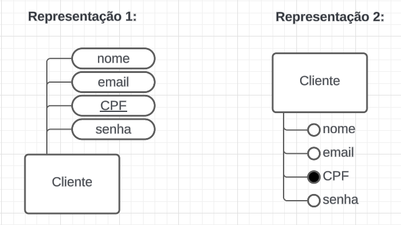 |

##### **2. Chave Estrangeira (Foreign Key)**

- **Descrição:** Atributo em uma tabela que referencia a chave primária de outra tabela, estabelecendo um relacionamento entre elas.

- **Exemplos:**

  1. **idCliente** na tabela **Pedido**, referenciando **Cliente**.
  2. **idProduto** na tabela **ItemPedido**, referenciando **Produto**.
  3. **idAutor** na tabela **Livro**, referenciando **Autor**.

- **Dicas de Boas Práticas:**

  - Mantenha a consistência de nomes para facilitar o entendimento. Por exemplo, não coloque somente "id" como prefixo, mas sim "idCliente", "idProduto". Isso ajuda a entender qual tabela está sendo referenciada.

- **Representação Visual no DER:**

  Indicada através dos **relacionamentos** entre entidades, colocando a chave estrangeira em um atributo da entidade.

##### **3. Chave Candidata (Candidate Key)**

- **Descrição:** Atributo(s) que poderiam ser escolhidos como chave primária. Essa definião é importante para a normalização do banco de dados, que visa reduzir a redundância e a inconsistência dos dados.

- **Exemplos:**

  1. **CPF** e **RG** em **Pessoa**; ambos são únicos, mas apenas um pode ser a chave primária. O outro seria uma chave candidata.
  2. **email** e **nomeUsuario** em **Usuário**.
  3. **placa** e **chassi** em **Veículo**.

- **Dicas de Boas Práticas:**

  - Analise todos os atributos únicos antes de escolher a chave primária.
  - Considere estabilidade e imutabilidade ao selecionar a chave primária.

- **Representação Visual no DER:**

  Apenas a chave primária é sublinhada; chaves candidatas são atributos normais.

##### **4. Chave Alternativa (Alternate Key)**

- **Descrição:** Chave candidata que não foi escolhida como chave primária.

- **Exemplos:**

  1. **RG** em **Pessoa**, se **CPF** for a chave primária.
  2. **email** em **Cliente**, se **ID_Cliente** for a chave primária.
  3. **nomeUsuario** em **Usuário**, se **ID_Usuario** for a chave primária.

- **Dicas de Boas Práticas:**

  - Podem ser utilizadas para garantir a unicidade em outros atributos.
  - Defina restrições únicas no banco de dados para essas chaves.

- **Representação Visual no DER:**

  Não há distinção visual específica; tratadas como atributos normais.

##### **5. Chave Composta (Composite Key)**

- **Descrição:** Chave primária formada por dois ou mais atributos.

- **Exemplos:**

  1. **idDisciplina** e **número** em **Turma**.
  2. **idCliente** e **idProduto** em **ItemPedido**.
  3. **idAutor** e **idLivro** em **Autoria**.

- **Dicas de Boas Práticas:**

  - Use quando nenhum atributo sozinho pode identificar unicamente um registro.
  - Certifique-se de que a combinação dos atributos seja sempre única.

- **Representação Visual no DER:**

  Atributos que compõem a chave são **sublinhados**.

| 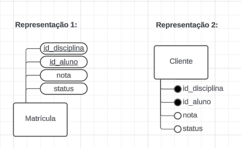 |

##### **6. Chave Secundária (Secondary Key)**

- **Descrição:** Atributo usado para criar índices e acelerar consultas, mas que não é necessariamente único.

- **Exemplos:**

  1. **nome** em **Cliente** para buscas frequentes por nome.
  2. **categoria** em **Produto** para filtrar produtos.
  3. **dataCompra** em **Pedido** para consultas por período.

- **Dicas de Boas Práticas:**

  - Identifique atributos frequentemente usados em consultas.
  - Crie índices no banco de dados para esses atributos.

- **Representação Visual no DER:**

  Não há representação específica; são atributos normais.

##### **7. Chave Super (Super Key)**

- **Descrição:** Qualquer conjunto de atributos que identifica unicamente uma linha na tabela. Inclui a chave primária e outras combinações que podem ser supérfluas.

- **Exemplos:**

  1. **ID_Cliente** sozinho, ou **ID_Cliente** combinado com **CPF** em **Cliente**.
  2. **matricula** em **Funcionário**, ou **matricula** e **CPF** juntos.
  3. **ID_Pedido**, ou **ID_Pedido** e **dataPedido** em **Pedido**.

- **Dicas de Boas Práticas:**

  - Evite usar super chaves com atributos desnecessários.
  - Prefira chaves simples e eficientes.

- **Representação Visual no DER:**

  Não são explicitamente representadas.

---

### **Relacionamentos**

Os **relacionamentos** definem como as entidades interagem entre si no modelo de dados. Eles são fundamentais para entender como as informações estão conectadas e como os dados serão armazenados no banco de dados. Compreender os tipos de relacionamentos é essencial para criar um banco de dados eficiente e bem estruturado.

Existem três tipos principais de relacionamentos:

1. **Relacionamento Um-para-Um (1:1)**
2. **Relacionamento Um-para-Muitos (1:N)**
3. **Relacionamento Muitos-para-Muitos (N:M)**

Esses números (1:1, 1:N, N:M) representam as **cardinalidades** dos relacionamentos, ou seja, quantos registros de uma entidade estão associados a quantos registros da outra entidade.

| 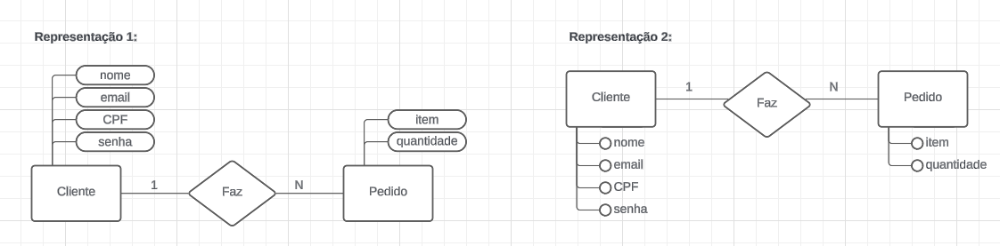 |

#### **1. Relacionamento Um-para-Um (1:1)**

- **Descrição:**

  No relacionamento **um-para-um**, cada registro (ou linha) da entidade A está associado a **no máximo um** registro da entidade B, e vice-versa. Isso significa que para cada dado na tabela A, existe **no máximo um** dado correspondente na tabela B.

- **Exemplos Simples:**

  1. **Pessoa e Carteira de Identidade:**

     - **Pessoa**: Cada pessoa possui uma única carteira de identidade.
     - **Carteira de Identidade**: Cada carteira de identidade pertence a uma única pessoa.

  2. **Usuário e Perfil:**

     - **Usuário**: Cada usuário em um sistema tem um perfil único com suas configurações.
     - **Perfil**: Cada perfil está associado a um único usuário.

  3. **País e Capital:**

     - **País**: Cada país tem uma única capital.
     - **Capital**: Cada capital é de um único país.

- **Como Representar no DER:**

  No Diagrama Entidade-Relacionamento (DER), um relacionamento um-para-um é representado por um losango conectado a duas entidades, com o número "1" próximo às linhas que ligam o relacionamento às entidades.

  ```
  [Pessoa] 1 --------- 1 [Carteira de Identidade]
  ```

- **Como Transformar em Tabelas:**

  Existem duas abordagens para implementar um relacionamento 1:1 no banco de dados:

  **1. Combinar as Entidades em uma Única Tabela:**

     - **Quando Usar:** Se as duas entidades sempre existem juntas e têm uma relação direta.
     - **Implementação:** Criar uma única tabela que contém os atributos de ambas as entidades.
     - **Exemplo:**
       - Tabela `Pessoa` com atributos de pessoa e carteira de identidade.

  **2. Manter Entidades Separadas com Chave Estrangeira Única:**

     - **Quando Usar:** Quando as entidades podem existir separadamente ou para manter uma estrutura mais organizada.
     - **Implementação:**
       - Adicionar uma chave estrangeira em uma das tabelas que referencia a chave primária da outra tabela.
       - Garantir que essa chave estrangeira seja única (definir como UNIQUE).
     - **Exemplo:**
       - Tabela `Pessoa` com atributo `carteira_identidade_id` que referencia `CarteiraIdentidade`.
       - Ou tabela `CarteiraIdentidade` com `pessoa_id` que referencia `Pessoa`.

- **Exemplo Prático:**

  **Tabelas:**

  - **Pessoa**
    - `pessoa_id` (PK)
    - `nome`
    - `data_nascimento`
    - `carteira_identidade_id` (FK, UNIQUE)

  - **CarteiraIdentidade**
    - `carteira_identidade_id` (PK)
    - `numero`
    - `data_emissao`
    - `pessoa_id` (FK, UNIQUE) *alternativa*

- **Dicas de Boas Práticas:**

  - **Avalie a Necessidade de Separação:**
    - Se as entidades são conceitualmente distintas e podem existir separadamente, mantenha-as em tabelas separadas. Em algumas vezes você não precisa pegar todos os dados de uma entidade, então é melhor separar, para não trazer dados desnecessários nas consultas.
  - **Integridade Referencial:**
    - Use restrições de chave estrangeira para garantir a integridade dos dados.
  - **Chave Única:**
    - Defina a chave estrangeira como UNIQUE para manter o relacionamento 1:1.

---

#### **2. Relacionamento Um-para-Muitos (1:N)**

- **Descrição:**

  No relacionamento **um-para-muitos**, um registro da entidade A pode estar associado a **vários** registros da entidade B, mas cada registro de B está associado a **apenas um** registro de A.

- **Exemplos Simples:**

  1. **Cliente e Pedido:**

     - **Cliente**: Um cliente pode fazer vários pedidos.
     - **Pedido**: Cada pedido é feito por um único cliente.

  2. **Professor e Turma:**

     - **Professor**: Um professor pode lecionar em várias turmas.
     - **Turma**: Cada turma é ministrada por um único professor.

  3. **Departamento e Funcionário:**

     - **Departamento**: Um departamento tem vários funcionários.
     - **Funcionário**: Cada funcionário trabalha em um único departamento.

- **Como Representar no DER:**

  No DER, o relacionamento um-para-muitos é representado por um losango conectado às entidades, com "1" próximo à entidade do lado "um" e "N" ou "*" próximo à entidade do lado "muitos".

  ```
  [Professor] 1 --------- N [Turma]
  ```

- **Como Transformar em Tabelas:**

  **Passos:**

  - **Adicionar Chave Estrangeira na Tabela do Lado "Muitos":**
    - Adicionar uma coluna na tabela da entidade "muitos" que referencia a chave primária da entidade "um".

  - **Implementação:**
    - Na tabela `Turma`, adicionar `professor_id` como chave estrangeira para `Professor`.

- **Exemplo Prático:**

  **Tabelas:**

  - **Professor**
    - `professor_id` (PK)
    - `nome`
    - `especialidade`

  - **Turma**
    - `turma_id` (PK)
    - `nome_disciplina`
    - `horario`
    - `professor_id` (FK para `Professor`)

- **Dicas de Boas Práticas:**

  - **Integridade Referencial:**
    - Defina a chave estrangeira com restrições para garantir que cada turma esteja associada a um professor existente.
  - **Nomeação Clara:**
    - Use nomes de colunas que deixem claro o relacionamento, como `professor_id`.
  - **Evitar Redundância:**
    - Não armazene informações do professor na tabela `Turma` além da chave estrangeira.

---

#### **3. Relacionamento Muitos-para-Muitos (N:M)**

- **Descrição:**

  No relacionamento **muitos-para-muitos**, vários registros da entidade A podem estar associados a vários registros da entidade B, e vice-versa.

- **Exemplos Simples:**

  1. **Aluno e Disciplina:**

     - **Aluno**: Um aluno pode se matricular em várias disciplinas.
     - **Disciplina**: Uma disciplina pode ter vários alunos matriculados.

  2. **Produto e Pedido:**

     - **Produto**: Um produto pode estar em vários pedidos.
     - **Pedido**: Um pedido pode conter vários produtos.

  3. **Autor e Livro:**

     - **Autor**: Um autor pode escrever vários livros.
     - **Livro**: Um livro pode ter vários autores.

- **Como Representar no DER:**

  No DER, o relacionamento muitos-para-muitos é representado por um losango conectado às entidades, com "N" ou "*" próximo a ambas as entidades.

  ```
  [Aluno] N --------- N [Disciplina]
  ```

- **Como Transformar em Tabelas:**

  **Passos:**

  - **Criar uma Entidade Associativa (Tabela Intermediária):**
    - Criar uma nova tabela que representa o relacionamento.
    - Essa tabela contém chaves estrangeiras para cada uma das entidades relacionadas.
    - As chaves estrangeiras juntas formam a chave primária da tabela intermediária (ou você pode criar uma chave primária própria).

  - **Implementação:**
    - Criar a tabela `Matrícula` com `aluno_id` e `disciplina_id` como chaves estrangeiras.

- **Exemplo Prático:**

  **Tabelas:**

  - **Aluno**
    - `aluno_id` (PK)
    - `nome`
    - `curso`

  - **Disciplina**
    - `disciplina_id` (PK)
    - `nome`
    - `creditos`

  - **Matrícula**
    - `matricula_id` (PK) *opcional, se não usar chave composta*
    - `aluno_id` (FK para `Aluno`)
    - `disciplina_id` (FK para `Disciplina`)
    - `data_matricula`

    - **Chave Primária:** Pode ser composta por (`aluno_id`, `disciplina_id`) ou um campo `matricula_id`.

- **Dicas de Boas Práticas:**

  - **Nomeação Significativa:**
    - Dê um nome claro à tabela intermediária, como `Matrícula`, `ItemPedido`, `AutorLivro`.
  - **Atributos Adicionais:**
    - Se houver informações específicas sobre o relacionamento (como `data_matricula`), inclua-as na tabela intermediária.
  - **Integridade Referencial:**
    - Defina chaves estrangeiras com restrições para manter a consistência dos dados.

---

### **Transformação dos Relacionamentos em Tabelas**

Vamos detalhar como os relacionamentos são transformados em tabelas, com base nos exemplos anteriores.

#### **Exemplo 1: Cliente e Pedido (1:N)**

- **Entidades:**

  - **Cliente**
    - `cliente_id` (PK)
    - `nome`
    - `email`

  - **Pedido**
    - `pedido_id` (PK)
    - `data_pedido`
    - `valor_total`

- **Implementação do Relacionamento:**

  - Na tabela `Pedido`, adicionar `cliente_id` como chave estrangeira para `Cliente`.

- **Tabelas Finais:**

  - **Cliente**
    - `cliente_id` (PK)
    - `nome`
    - `email`

  - **Pedido**
    - `pedido_id` (PK)
    - `data_pedido`
    - `valor_total`
    - `cliente_id` (FK para `Cliente`)

#### **Exemplo 2: Produto e Pedido (N:M)**

- **Entidades:**

  - **Produto**
    - `produto_id` (PK)
    - `nome`
    - `preco`

  - **Pedido**
    - `pedido_id` (PK)
    - `data_pedido`
    - `valor_total`

- **Entidade Associativa:**

  - **ItemPedido**
    - `item_pedido_id` (PK) *opcional*
    - `pedido_id` (FK para `Pedido`)
    - `produto_id` (FK para `Produto`)
    - `quantidade`
    - `preco_unitario`

    - **Chave Primária:** Pode ser composta por (`pedido_id`, `produto_id`) ou um campo `item_pedido_id`.

- **Tabelas Finais:**

  - **Produto**
    - `produto_id` (PK)
    - `nome`
    - `preco`

  - **Pedido**
    - `pedido_id` (PK)
    - `data_pedido`
    - `valor_total`

  - **ItemPedido**
    - `item_pedido_id` (PK) *se houver*
    - `pedido_id` (FK para `Pedido`)
    - `produto_id` (FK para `Produto`)
    - `quantidade`
    - `preco_unitario`

#### **Exemplo 3: Autor e Livro (N:M)**

- **Entidades:**

  - **Autor**
    - `autor_id` (PK)
    - `nome`

  - **Livro**
    - `livro_id` (PK)
    - `titulo`

- **Entidade Associativa:**

  - **AutorLivro**
    - `autor_livro_id` (PK) *opcional*
    - `autor_id` (FK para `Autor`)
    - `livro_id` (FK para `Livro`)

    - **Chave Primária:** Pode ser composta por (`autor_id`, `livro_id`) ou um campo `autor_livro_id`.

- **Tabelas Finais:**

  - **Autor**
    - `autor_id` (PK)
    - `nome`

  - **Livro**
    - `livro_id` (PK)
    - `titulo`

  - **AutorLivro**
    - `autor_livro_id` (PK) *se houver*
    - `autor_id` (FK para `Autor`)
    - `livro_id` (FK para `Livro`)

---
> **IMPORTANTE:** A decisão da cardinalidade do relacionamento depende de cada projeto. Pode ser que em algum projeto, vários professores possam lecionar em uma unica turma e o mesmo professor lecionar em várias turmas. Nesse caso, o relacionamento seria N:M, diferente de um dos nossos exemplos passados. Por isso, é importante entender o contexto do sistema e os requisitos do projeto para definir a cardinalidade correta. 
---

### **Entidades Associativas**

As **entidades associativas** são usadas para representar relacionamentos muitos-para-muitos, armazenando as chaves estrangeiras das entidades relacionadas e possivelmente atributos adicionais.

#### **Exemplos de Entidades Associativas:**

1. **Matrícula** entre **Aluno** e **Disciplina**:
   - **Atributos:** `idAluno` (FK), `idDisciplina` (FK), `dataMatricula`, `nota`.

2. **ItemPedido** entre **Pedido** e **Produto**:
   - **Atributos:** `idPedido` (FK), `idProduto` (FK), `quantidade`, `preço`.

3. **Autoria** entre **Autor** e **Livro**:
   - **Atributos:** `idAutor` (FK), `idLivro` (FK), `papel` (escritor, coautor).

#### **Dicas de Boas Práticas:**

- Nomeie a entidade associativa de forma significativa.
- Inclua atributos relevantes que descrevam o relacionamento.

#### **Representação Visual no DER:**

Representadas por **retângulos** conectados às entidades principais através de relacionamentos.

| 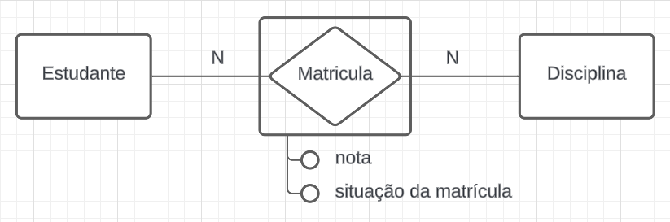 |

---

### **Especialização e Generalização**

#### **Generalização**

- **Descrição:** Processo de abstrair entidades semelhantes em uma entidade genérica.

- **Exemplos:**

  1. **Carro** e **Moto** generalizados em **Veículo**.
  2. **Conta Corrente** e **Conta Poupança** generalizadas em **Conta Bancária**.
  3. **Professor** e **Aluno** generalizados em **Pessoa**.

- **Dicas de Boas Práticas:**

  - Use quando várias entidades compartilham atributos comuns.
  - Facilita a manutenção e evita redundância.

- **Representação Visual no DER:**

  Um **triângulo** indicando a hierarquia, conectado à entidade genérica e às entidades especializadas.

#### **Especialização**

- **Descrição:** Processo de criar entidades específicas a partir de uma entidade genérica.

- **Exemplos:**

  1. **Funcionário** especializado em **Gerente** e **Operário**.
  2. **Veículo** especializado em **Carro**, **Moto**, **Caminhão**.
  3. **Pagamento** especializado em **Pagamento em Dinheiro**, **Cartão de Crédito**, **Cheque**.

- **Dicas de Boas Práticas:**

  - Use quando entidades específicas têm atributos ou comportamentos distintos.
  - Ajuda a modelar diferenças importantes entre entidades.

- **Representação Visual no DER:**

  Similar à generalização, usando um **triângulo** para indicar a especialização.

---

### **Cardinalidades e Participação**

As **cardinalidades** definem o número de ocorrências de uma entidade que se relaciona com as ocorrências de outra entidade.

#### **Tipos de Cardinalidades:**

- **1:1 (Um-para-Um):** Cada ocorrência de A se relaciona com uma ocorrência de B.
- **1:N (Um-para-Muitos):** Uma ocorrência de A se relaciona com várias ocorrências de B.
- **N:M (Muitos-para-Muitos):** Várias ocorrências de A se relacionam com várias ocorrências de B.

#### **Participação:**

- **Participação Total (Obrigatória):** A entidade não pode existir sem o relacionamento.
- **Participação Parcial (Opcional):** A entidade pode existir sem participar do relacionamento.

#### **Exemplos:**

1. **Funcionário** e **Dependente**:
   - Um funcionário pode ter vários dependentes (1:N).
   - Um dependente deve estar associado a um funcionário (participação total do dependente).

2. **Cliente** e **Conta Bancária**:
   - Um cliente pode ter várias contas (1:N).
   - Uma conta deve pertencer a um cliente (participação total da conta).

3. **Produto** e **Fornecedor**:
   - Um produto pode ter vários fornecedores (N:M).
   - Um fornecedor pode fornecer vários produtos.

#### **Dicas de Boas Práticas:**

- Defina claramente as cardinalidades para evitar ambiguidades.
- Utilize símbolos e notações adequadas no DER para representar cardinalidades e participações.

---

### **3. Entidades Associativas**

- **Descrição:**

  As **Entidades Associativas** são utilizadas quando um **relacionamento precisa se relacionar com outro relacionamento**. Nesse caso, o relacionamento é elevado ao status de entidade para que possa:

  - **Armazenar atributos próprios:** Quando o relacionamento em si possui informações adicionais que precisam ser registradas.
  - **Representar um conceito importante:** Quando o relacionamento é significativo no domínio do problema e precisa ser tratado como uma entidade independente.

  Isso permite uma modelagem mais rica e precisa dos dados, especialmente em situações complexas.

- **Quando devem ser usadas:**

  - **Quando um relacionamento precisa se relacionar com outros relacionamentos.**
  - **Relacionamentos com atributos próprios que precisam ser muito detalhados.**
  - **Para representar eventos ou interações que são centrais no domínio do negócio.**

- **Exemplos:**

  1. **Atendimento** como Entidade Associativa entre **Paciente** e **Médico**, que se relaciona com **Hospital**:

     - **Contexto:** Um paciente é atendido por um médico. O atendimento possui atributos como data, horário, diagnóstico, e precisa se relacionar com o hospital onde ocorreu, pois pode ser que o mesmo paciente seja atendido pelo mesmo médico em hospitais diferentes.
     - **Como é modelado:**
       - **Entidades Principais:** `Paciente` e `Médico`.
       - **Relacionamento Original:** `AtendidoPor`.
       - **Entidade Associativa:** `Atendimento`, criada a partir do relacionamento `AtendidoPor`, com atributos próprios.
       - **Relacionamento Adicional:** `Atendimento` se relaciona com `Hospital`.

     

  2. **Transação** como Entidade Associativa entre **Conta Bancária** e **Operação**, que se relaciona com **Funcionário**:

     - **Contexto:** Uma conta bancária realiza operações financeiras (depósito, saque, transferência). Cada transação possui atributos como valor, data, e precisa se relacionar com o funcionário que a autorizou.
     - **Como é modelado:**
       - **Entidades Principais:** `Conta Bancária` e `Operação`.
       - **Relacionamento Original:** `Realiza`.
       - **Entidade Associativa:** `Transação`, com atributos como `valor`, `data`.
       - **Relacionamento Adicional:** `Transação` se relaciona com `Funcionário`.

     

  3. **Contrato** como Entidade Associativa entre **Empresa** e **Fornecedor**, que se relaciona com **Produto**:

     - **Contexto:** Uma empresa firma contratos com fornecedores. O contrato possui atributos como valor total, prazo, e precisa se relacionar com os produtos fornecidos.
     - **Como é modelado:**
       - **Entidades Principais:** `Empresa` e `Fornecedor`.
       - **Relacionamento Original:** `Firma`.
       - **Entidade Associativa:** `Contrato`, com atributos como `valorTotal`, `prazo`.
       - **Relacionamento Adicional:** `Contrato` se relaciona com `Produto`.

     

  4. **Reserva** como Entidade Associativa entre **Cliente** e **Voo**, que se relaciona com **Pagamento**:

     - **Contexto:** Um cliente faz reservas em voos. A reserva possui atributos como número de assento, classe, e precisa se relacionar com o pagamento efetuado.
     - **Como é modelado:**
       - **Entidades Principais:** `Cliente` e `Voo`.
       - **Relacionamento Original:** `Reserva`.
       - **Entidade Associativa:** `Reserva`, com atributos como `assento`, `classe`.
       - **Relacionamento Adicional:** `Reserva` se relaciona com `Pagamento`.

     

  5. **Pedido** como Entidade Associativa entre **Cliente** e **Vendedor**, que se relaciona com **Produto** e **Entrega**:

     - **Contexto:** Um cliente faz um pedido a um vendedor. O pedido possui atributos como data, valor total, e precisa se relacionar com os produtos vendidos e a entrega.
     - **Como é modelado:**
       - **Entidades Principais:** `Cliente` e `Vendedor`.
       - **Relacionamento Original:** `FazPedido`.
       - **Entidade Associativa:** `Pedido`, com atributos como `data`, `valorTotal`.
       - **Relacionamentos Adicionais:** `Pedido` se relaciona com `Produto` e `Entrega`.

     

- **Dicas de Boas Práticas:**
  
  - **Relacionamentos entre Relacionamentos:**
    - Quando um relacionamento precisa se relacionar com outra entidade ou relacionamento, utilize uma entidade associativa para permitir essa conexão.
  
  - **Clareza na Modelagem:**
    - Nomeie a entidade associativa de forma que reflita claramente seu propósito no modelo.
    - Mantenha a consistência na representação gráfica para facilitar a compreensão.

- **Representação Visual no DER:**

  - **Entidade Associativa:**
    - Representada por um **retângulo**, como outras entidades.
    - Conectada às entidades originais através de relacionamentos.
  
  - **Relacionamentos Adicionais:**
    - A entidade associativa pode participar de novos relacionamentos com outras entidades ou até mesmo com outros relacionamentos transformados em entidades.
  
  - **Exemplo Genérico:**

    

**Exemplos Adicionais:**

1. **Evento** como Entidade Associativa entre **Artista** e **Local**, que se relaciona com **Patrocínio**:

   - **Contexto:** Um artista realiza eventos em diferentes locais. O evento possui atributos como data, horário, e precisa se relacionar com empresas que o patrocinam.
   - **Modelagem:**
     - **Entidades Principais:** `Artista` e `Local`.
     - **Entidade Associativa:** `Evento` com atributos próprios.
     - **Relacionamento Adicional:** `Evento` se relaciona com `Patrocínio`.

2. **Participação** como Entidade Associativa entre **Aluno** e **Projeto de Pesquisa**, que se relaciona com **Orientador**:

   - **Contexto:** Alunos participam de projetos de pesquisa. A participação possui atributos como data de início, função, e precisa se relacionar com o orientador responsável.
   - **Modelagem:**
     - **Entidades Principais:** `Aluno` e `Projeto de Pesquisa`.
     - **Entidade Associativa:** `Participação` com atributos próprios.
     - **Relacionamento Adicional:** `Participação` se relaciona com `Orientador`.

---

### **Agregação**

**Agregação** é um conceito utilizado no Modelo Entidade-Relacionamento (MER) que permite tratar um **relacionamento** como se fosse uma **entidade**. Isso é especialmente útil quando precisamos que um relacionamento participe de outro relacionamento, ou seja, quando um relacionamento precisa se relacionar com outras entidades. A agregação nos ajuda a representar interações mais complexas de forma clara e organizada.

#### **Quando Usar Agregação**

- **Relacionamentos entre Relacionamentos**: Quando um relacionamento precisa se relacionar com outra entidade ou relacionamento.
- **Simplificação de Diagramas Complexos**: Para reduzir a complexidade visual em diagramas que possuem muitos relacionamentos.
- **Representar Interações Complexas**: Quando o relacionamento em si possui atributos próprios ou é significativo no contexto do negócio.

#### **Exemplo Simples de Agregação**

Imagine uma empresa onde:

- **Funcionários** trabalham em **Projetos**.
- **Clientes** solicitam **Projetos**.

Agora, queremos representar que um **Funcionário** trabalha em um **Projeto** específico para um **Cliente**. O relacionamento "trabalha em" precisa se relacionar com a entidade **Cliente**.

Para modelar isso, podemos usar a **agregação**.

#### **Passo a Passo da Agregação**

1. **Identificar o Relacionamento que Precisa ser Agregado**

   - O relacionamento "trabalha em" entre **Funcionário** e **Projeto**.

2. **Transformar o Relacionamento em uma Entidade**

   - Criamos uma nova entidade chamada **Alocação** (ou outro nome apropriado).
   - Esta entidade representa o fato de um funcionário estar alocado em um projeto.

3. **Associar a Nova Entidade com a Terceira Entidade**

   - **Alocação** se relaciona com **Cliente**.
   - Isso nos permite registrar para qual cliente o funcionário está trabalhando em determinado projeto.

4. **Adicionar Atributos Relevantes**

   - **Alocação** pode ter atributos como:
     - **data_inicio**
     - **data_fim**
     - **papel** (ex.: desenvolvedor, gerente)
     - **horas_trabalhadas**

#### **Representação Visual no DER**

- **Funcionário** e **Projeto** estão ligados pelo relacionamento "trabalha em".
- Aplicamos a agregação e transformamos "trabalha em" na entidade **Alocação**.
- **Alocação** então se relaciona com **Cliente**.
- O diagrama reflete essa estrutura de forma clara.

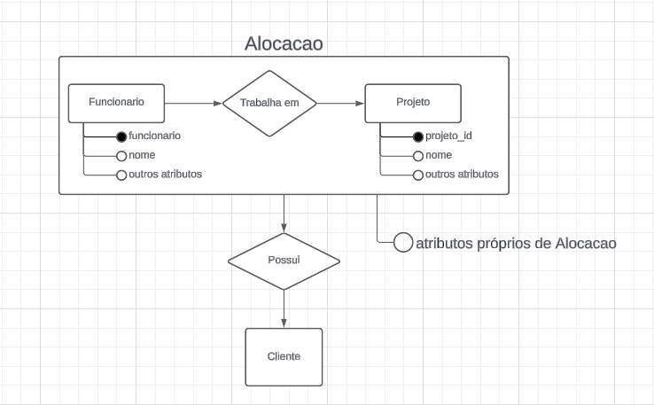

#### **Como Transformar em Tabelas**

**1. Tabela Funcionário**

- `funcionario_id` (PK)
- `nome`
- Outros atributos do funcionário

**2. Tabela Projeto**

- `projeto_id` (PK)
- `nome`
- Outros atributos do projeto

**3. Tabela Cliente**

- `cliente_id` (PK)
- `nome`
- Outros atributos do cliente

**4. Tabela Alocação**

- `alocacao_id` (PK)
- `funcionario_id` (FK para Funcionário)
- `projeto_id` (FK para Projeto)
- `cliente_id` (FK para Cliente)
- `data_inicio`
- `data_fim`
- `papel`
- `horas_trabalhadas`

**Explicação:**

- A tabela **Alocação** reúne as chaves estrangeiras de **Funcionário**, **Projeto** e **Cliente**.
- Armazena informações específicas da alocação do funcionário no projeto para um cliente.

#### **Outro Exemplo de Agregação**

Considere um sistema acadêmico:

- **Professor** ensina **Disciplina**.
- **Disciplina** faz parte de um **Curso**.

Queremos relacionar que o **Professor** ensina uma **Disciplina** em um **Curso** específico.

**Passo a Passo:**

1. **Identificar o Relacionamento a ser Agregado**

   - O relacionamento "ensina" entre **Professor** e **Disciplina**.

2. **Transformar o Relacionamento em uma Entidade**

   - Criamos a entidade **Ensino**.

3. **Associar a Nova Entidade com a Terceira Entidade**

   - **Ensino** se relaciona com **Curso**.

4. **Adicionar Atributos Relevantes**

   - **Ensino** pode ter atributos como:
     - **semestre**
     - **ano**
     - **sala**

**Tabelas Resultantes:**

- **Professor**
  - `professor_id` (PK)
  - `nome`
- **Disciplina**
  - `disciplina_id` (PK)
  - `nome`
- **Curso**
  - `curso_id` (PK)
  - `nome`
- **Ensino**
  - `ensino_id` (PK)
  - `professor_id` (FK)
  - `disciplina_id` (FK)
  - `curso_id` (FK)
  - `semestre`
  - `ano`
  - `sala`

#### **Dicas de Boas Práticas**

- **Clareza e Simplicidade**

  - Use a agregação quando ela tornar o modelo mais fácil de entender.
  - Evite complicar o modelo com agregações desnecessárias.

- **Nomeação Significativa**

  - Dê nomes claros às entidades agregadas, refletindo seu propósito.
  - **Exemplo:** "Alocação" em vez de "TrabalhoProjetoCliente".

- **Documentação**

  - Explique o porquê da agregação e como as entidades estão relacionadas.
  - Isso ajuda outros desenvolvedores a entenderem o modelo.

- **Consistência**

  - Seja consistente na forma como aplica a agregação no modelo.
  - Use padrões que facilitem a leitura e manutenção.

#### **Quando Evitar a Agregação**

- **Complexidade Desnecessária**

  - Se a agregação não adicionar valor ou clareza, é melhor evitá-la.
  - Mantenha o modelo o mais simples possível.

- **Alternativas Mais Simples**

  - Às vezes, uma entidade associativa simples resolve o problema.
  - Avalie se a agregação é realmente necessária.

---

### **Especialização e Generalização**

No modelo de banco de dados, **especialização** e **generalização** são técnicas usadas para organizar e simplificar a estrutura dos dados. Elas ajudam a representar situações em que algumas entidades (tabelas) compartilham características comuns, mas também têm diferenças específicas. Esses conceitos são como criar uma "família" de entidades, onde algumas são mais genéricas (pais) e outras são mais específicas (filhos).

#### **O que é Generalização?**

**Generalização** é o processo de identificar características comuns em duas ou mais entidades específicas e criar uma entidade mais genérica que as engloba. Pense nisso como subir um nível para criar uma categoria mais ampla que abrange todas as entidades menores.

- **Imagine que você está agrupando coisas parecidas em uma única categoria maior.**

##### **Exemplos Práticos de Generalização:**

1. **Animais Domésticos: Cachorro e Gato**

   - **Entidades Específicas:**
     - **Cachorro**: Tem atributos como raça, tamanho, necessidade de exercícios.
     - **Gato**: Tem atributos como pelagem, independência, preferência por ambientes.
   - **Características em Comum:**
     - Ambos são animais domésticos, têm nome, idade, dono, precisam de alimentação.
   - **Entidade Generalizada:**
     - **Animal Doméstico**: Cria-se uma entidade que contém os atributos comuns.
   - **Como Funciona:**
     - **Cachorro** e **Gato** se tornam entidades que herdam de **Animal Doméstico**.
  
  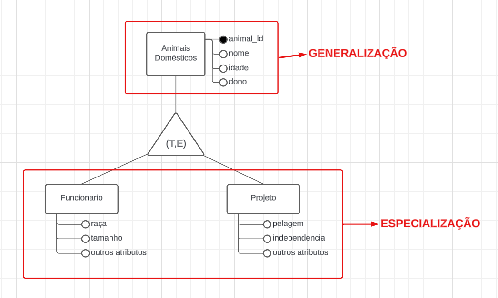

2. **Veículos: Carro e Bicicleta**

   - **Entidades Específicas:**
     - **Carro**: Possui motor, número de portas, tipo de combustível.
     - **Bicicleta**: Tem número de marchas, tipo de freio.
   - **Características em Comum:**
     - Ambos são meios de transporte, têm marca, modelo, cor.
   - **Entidade Generalizada:**
     - **Veículo**: Contém os atributos comuns.
   - **Como Funciona:**
     - **Carro** e **Bicicleta** herdam de **Veículo** e mantêm seus atributos específicos.

3. **Funcionários: Professor e Administrador**

   - **Entidades Específicas:**
     - **Professor**: Disciplina que leciona, carga horária.
     - **Administrador**: Departamento, nível de acesso.
   - **Características em Comum:**
     - Ambos têm nome, CPF, salário, data de contratação.
   - **Entidade Generalizada:**
     - **Funcionário**: Agrupa os atributos comuns.
   - **Como Funciona:**
     - **Professor** e **Administrador** herdam de **Funcionário**.

##### **Como Representar no Diagrama (DER):**

- A generalização é representada por um **triângulo** que conecta as entidades específicas à entidade geral.
- O triângulo aponta para a entidade geral (a categoria mais ampla).

**Exemplo Simplificado:**

```
            [Veículo]
              /    \
             /      \
        [Carro]   [Bicicleta]
```

---

#### **O que é Especialização?**

**Especialização** é o processo inverso da generalização. Aqui, você começa com uma entidade geral e a divide em entidades mais específicas, adicionando detalhes exclusivos a cada uma. Pense nisso como descer um nível para detalhar categorias específicas dentro de uma categoria ampla.

- **É como pegar uma categoria grande e dividi-la em partes menores com características únicas.**

##### **Exemplos Práticos de Especialização:**

1. **Pessoa sendo especializada em Aluno e Professor**

   - **Entidade Geral:**
     - **Pessoa**: Tem atributos como nome, endereço, telefone.
   - **Entidades Específicas:**
     - **Aluno**: Tem número de matrícula, curso.
     - **Professor**: Tem número de registro, disciplina que leciona.
   - **Como Funciona:**
     - **Aluno** e **Professor** herdam de **Pessoa** e adicionam seus próprios atributos.

2. **Conta Bancária sendo especializada em Conta Corrente e Conta Poupança**

   - **Entidade Geral:**
     - **Conta Bancária**: Número da conta, agência, saldo.
   - **Entidades Específicas:**
     - **Conta Corrente**: Limite de cheque especial.
     - **Conta Poupança**: Taxa de rendimento.
   - **Como Funciona:**
     - **Conta Corrente** e **Conta Poupança** herdam de **Conta Bancária**.

3. **Produto sendo especializado em Produto Digital e Produto Físico**

   - **Entidade Geral:**
     - **Produto**: Código, nome, preço.
   - **Entidades Específicas:**
     - **Produto Digital**: Formato do arquivo, tamanho em MB.
     - **Produto Físico**: Peso, dimensões, estoque.
   - **Como Funciona:**
     - **Produto Digital** e **Produto Físico** herdam de **Produto**.

##### **Como Representar no Diagrama (DER):**

- A especialização também é representada por um **triângulo**, mas agora ele conecta a entidade geral às entidades específicas.
- O triângulo aponta para as entidades específicas (as categorias detalhadas).

**Exemplo Simplificado:**

```
            [Pessoa]
              /    \
             /      \
        [Aluno]   [Professor]
```

---

#### **Como Funcionam Especialização e Generalização no Banco de Dados**

Em ambos os casos, estamos criando uma relação de **herança** entre entidades. Isso permite que as entidades específicas compartilhem atributos da entidade geral e tenham seus próprios atributos exclusivos.

**Principais Conceitos:**

- **Herança de Atributos:**
  - As entidades específicas herdam atributos e relacionamentos da entidade geral.
- **Tipos de Especialização/Generalização:**
  - **Total**: Todos os registros da entidade geral pertencem a alguma entidade específica.
    - Exemplo: Todo **Funcionário** é ou **Professor** ou **Administrador**.
  - **Parcial**: Alguns registros da entidade geral não pertencem a nenhuma entidade específica.
    - Exemplo: Uma **Pessoa** pode ser um **Aluno**, um **Professor** ou nenhum dos dois.
  - **Exclusiva**: Um registro da entidade geral pertence a apenas uma das entidades específicas.
    - Exemplo: Uma **Conta Bancária** é **Corrente** ou **Poupança**, mas não ambos.
  - **Não Exclusiva (Sobreposta)**: Um registro da entidade geral pode pertencer a várias entidades específicas.
    - Exemplo: Um **Funcionário** pode ser **Professor** e **Administrador** ao mesmo tempo.

---

#### **Como Transformar em Tabelas no Banco de Dados**

Existem várias maneiras de implementar especialização e generalização no banco de dados. Vamos ver as três principais abordagens com exemplos simples.

##### **1. Tabela Única para Todas as Entidades (Single Table Inheritance)**

- **Descrição:**
  - Criar uma única tabela que inclui todos os atributos da entidade geral e das entidades específicas.
  - Usar uma coluna extra para indicar o tipo de cada registro.
- **Vantagens:**
  - Simplicidade na estrutura do banco.
  - Fácil de consultar todos os registros.
- **Desvantagens:**
  - Muitos campos podem ficar vazios (nulos) se não forem aplicáveis a todos os registros.
  - Pode ficar confuso se houver muitas entidades específicas.

- **Exemplo Prático:**

  - **Tabela:** `Pessoa`
    - `pessoa_id` (PK)
    - `nome`
    - `endereco`
    - `telefone`
    - `tipo_pessoa` (indica se é "Aluno" ou "Professor")
    - **Atributos de Aluno:**
      - `numero_matricula`
      - `curso`
    - **Atributos de Professor:**
      - `numero_registro`
      - `disciplina`

##### **2. Tabelas Separadas com Herança (Class Table Inheritance)**

- **Descrição:**
  - Criar uma tabela para a entidade geral e tabelas separadas para cada entidade específica.
  - As tabelas específicas têm uma chave estrangeira que referencia a tabela geral.
- **Vantagens:**
  - Dados organizados de forma clara.
  - Evita campos nulos.
- **Desvantagens:**
  - Requer junções (joins) nas consultas para obter dados completos.
  - Estrutura mais complexa.

- **Exemplo Prático:**

  - **Tabela Geral:** `Pessoa`
    - `pessoa_id` (PK)
    - `nome`
    - `endereco`
    - `telefone`

  - **Tabela Específica:** `Aluno`
    - `pessoa_id` (PK, FK para `Pessoa`)
    - `numero_matricula`
    - `curso`

  - **Tabela Específica:** `Professor`
    - `pessoa_id` (PK, FK para `Pessoa`)
    - `numero_registro`
    - `disciplina`

##### **3. Tabelas Separadas sem Herança (Concrete Table Inheritance)**

- **Descrição:**
  - Criar tabelas separadas para cada entidade específica, incluindo os atributos da entidade geral.
  - Não há tabela para a entidade geral.
- **Vantagens:**
  - Consultas mais simples (não requer joins).
- **Desvantagens:**
  - Duplicação de dados comuns.
  - Dificuldade em manter a consistência dos dados comuns.

- **Exemplo Prático:**

  - **Tabela:** `Aluno`
    - `aluno_id` (PK)
    - `nome`
    - `endereco`
    - `telefone`
    - `numero_matricula`
    - `curso`

  - **Tabela:** `Professor`
    - `professor_id` (PK)
    - `nome`
    - `endereco`
    - `telefone`
    - `numero_registro`
    - `disciplina`

---

#### **Exemplo Completo Passo a Passo**

Vamos usar o exemplo da **Conta Bancária**, especializada em **Conta Corrente** e **Conta Poupança**, utilizando a segunda abordagem (tabelas separadas com herança).

**Passo 1: Definir a Entidade Geral**

- **Entidade Geral:** `ContaBancaria`
  - **Atributos:**
    - `conta_id` (PK)
    - `agencia`
    - `numero`
    - `saldo`

**Passo 2: Definir as Entidades Específicas**

- **Entidade Específica:** `ContaCorrente`
  - **Atributos:**
    - `conta_id` (PK, FK para `ContaBancaria`)
    - `limite_cheque_especial`

- **Entidade Específica:** `ContaPoupanca`
  - **Atributos:**
    - `conta_id` (PK, FK para `ContaBancaria`)
    - `taxa_rendimento`

**Passo 3: Criar as Tabelas no Banco de Dados**

- **Tabela Geral:** `ContaBancaria`
  - `conta_id` (PK)
  - `agencia`
  - `numero`
  - `saldo`

- **Tabela Específica:** `ContaCorrente`
  - `conta_id` (PK, FK para `ContaBancaria`)
  - `limite_cheque_especial`

- **Tabela Específica:** `ContaPoupanca`
  - `conta_id` (PK, FK para `ContaBancaria`)
  - `taxa_rendimento`

**Como Funciona:**

- Cada conta bancária está registrada na tabela `ContaBancaria`.
- Se a conta for corrente, haverá um registro correspondente na tabela `ContaCorrente`.
- Se a conta for poupança, haverá um registro na tabela `ContaPoupanca`.

---

#### **Dicas Simples para Aplicar Especialização e Generalização**

- **Identifique Atributos Comuns:**
  - Se várias entidades têm atributos iguais, considere criar uma entidade geral para agrupá-los.
- **Use Nomes Claros:**
  - Nomeie as entidades de forma que fique claro o relacionamento entre elas.
- **Evite Duplicação de Dados:**
  - A generalização ajuda a evitar repetir os mesmos atributos em várias entidades.
- **Escolha a Melhor Abordagem:**
  - Avalie qual método de implementação se adequa melhor ao seu projeto.
- **Documente Seu Modelo:**
  - Desenhe diagramas e anote os relacionamentos para facilitar o entendimento.

---

#### **Mais Exemplos Práticos**

1. **Veículos Especializados em Carro, Moto e Caminhão**

   - **Entidade Geral:**
     - **Veículo**: Placa, marca, modelo.
   - **Entidades Específicas:**
     - **Carro**: Número de portas, tipo de combustível.
     - **Moto**: Cilindradas, tipo de guidão.
     - **Caminhão**: Capacidade de carga, número de eixos.

2. **Dispositivos Eletrônicos Especializados em Computador e Smartphone**

   - **Entidade Geral:**
     - **DispositivoEletronico**: Marca, modelo, ano de fabricação.
   - **Entidades Específicas:**
     - **Computador**: Tipo de processador, memória RAM.
     - **Smartphone**: Tamanho da tela, capacidade da bateria.

3. **Evento Especializado em Concerto e Conferência**

   - **Entidade Geral:**
     - **Evento**: Data, local, organizador.
   - **Entidades Específicas:**
     - **Concerto**: Artista principal, gênero musical.
     - **Conferência**: Palestrantes, tema principal.

---

#### **Como Essas Entidades Viram Tabelas no Banco de Dados**

Vamos pegar o exemplo de **Veículo**, **Carro**, **Moto** e **Caminhão**, usando a segunda abordagem (tabelas separadas com herança).

**Tabelas:**

- **Veículo**
  - `veiculo_id` (PK)
  - `placa`
  - `marca`
  - `modelo`

- **Carro**
  - `veiculo_id` (PK, FK para `Veículo`)
  - `numero_portas`
  - `tipo_combustivel`

- **Moto**
  - `veiculo_id` (PK, FK para `Veículo`)
  - `cilindradas`
  - `tipo_guidao`

- **Caminhão**
  - `veiculo_id` (PK, FK para `Veículo`)
  - `capacidade_carga`
  - `numero_eixos`

**Funcionamento:**

- Todos os veículos estão na tabela `Veículo`.
- As características específicas de cada tipo de veículo estão nas tabelas correspondentes.
- A chave primária é compartilhada entre a tabela geral e as tabelas específicas.

---
