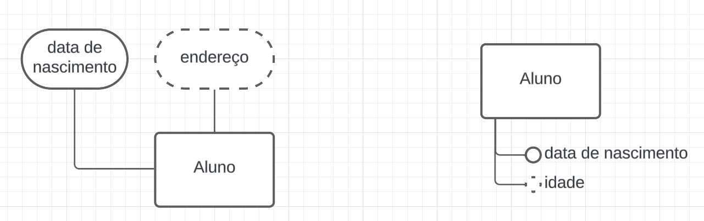

# Modelo Entidade-Relacionamento (MER) e Diagrama Entidade-Relacionamento (DER)

O **Modelo Entidade-Relacionamento (MER)** é uma técnica de modelagem conceitual que auxilia na representação da estrutura de um banco de dados de forma intuitiva. Ele descreve como os dados se relacionam entre si no contexto do seu projeto, facilitando o planejamento das tabelas que irão armazenar essas informações. No MER, o foco é entender e representar os requisitos de informação sem se preocupar com detalhes de implementação, como tipos de dados específicos ou estruturas físicas de armazenamento.

## Diagrama Entidade-Relacionamento (DER)

O **Diagrama Entidade-Relacionamento (DER)** é a representação gráfica do MER. Ele facilita a visualização das **entidades**, seus **atributos** e os **relacionamentos** entre elas, permitindo uma compreensão mais clara de como os dados estão interconectados.

---

## Componentes de um MER e DER

### **Entidades**

As **entidades** são os objetos principais que serão armazenados no banco de dados. Elas representam um conjunto, coleção, conceito ou objeto do mundo real que desejamos guardar informações. Por exemplo, uma entidade chamada **Cliente** se tornará uma tabela **Cliente**, onde cada linha da tabela apresenta o registro de um cliente específico, e os atributos (como nome, e-mail, CPF) serão as colunas dessa tabela.

#### **Exemplos de Entidades:**

1. **Cliente**: Agrupa dados de clientes de uma loja ou empresa.
2. **Produto**: Representa os itens disponíveis para venda.
3. **Funcionário**: Representa os empregados de uma empresa.

#### **Dicas de Boas Práticas:**

- **Nomeação:**
  - Use nomes no **singular** para entidades e atributos.
  - Utilize **letras maiúsculas** para entidades e **letras minúsculas** para atributos.
  - Exemplo: "Cliente" em vez de "Clientes" ou "cliente"; "nome" em vez de "NOME" ou "nomes".

- **Clareza e Simplicidade:**
  - Escolha nomes significativos que reflitam claramente o que a entidade representa.
  - Evite abreviações ou siglas que possam gerar confusão.
  - Não coloque caracteres especiais ou espaços nos nomes.

#### **Representação Visual no DER:**

As entidades são representadas por **retângulos**, com o nome da entidade escrito dentro ou acima do retângulo.

|  |

#### **Tipos de Entidades:**

##### **1. Entidades Fortes**

- **Descrição:** São entidades que possuem existência independente, ou seja, não dependem de outras entidades para existir. Elas possuem uma **chave primária própria** que as identifica unicamente.

- **Exemplos:**

  1. **Cliente**: Um cliente pode existir independentemente de outras entidades. Não importa se a loja tem produtos ou pedidos, ainda sim pode existir dados de clientes.
  2. **Produto**: Um produto tem sua própria identidade e não depende de outras entidades. Não precisa de clientes ou qualquer outra entidade para existir um produto.
  3. **Funcionário**: Um funcionário existe na empresa mesmo que não tenha clientes ou produtos associados.

- **Dicas de Boas Práticas:**

  - **Pergunta-chave:** "Essa entidade pode existir sozinha, sem depender de outra?" Se a resposta for "sim", ela é uma entidade forte.
  - **Consistência:** Certifique-se de que a entidade possui uma chave primária única.
  - **Simplicidade:** Evite entidades complexas que misturam múltiplos conceitos.
  - **Reutilização:** Considere reutilizar entidades existentes em vez de criar novas.
  - **Observação:** Na maioria dos casos, as entidades são fortes. Pode existir bancos com apenas entidades fortes.

- **Representação Visual no DER:**

  Entidades fortes são representadas por **retângulos simples**.

|  |

##### **2. Entidades Fracas**

- **Descrição:** São entidades que dependem de outra entidade (entidade forte) para existir. Elas não possuem uma chave primária própria suficiente para identificá-las unicamente no banco sem a chave da entidade forte.

- **Exemplos:**

  1. **Dependente**: Dependente de um funcionário, como filhos ou cônjuge. Não faz sentido existir um dependente sem um funcionário associado. O dependente é identificado pela combinação de **id_funcionário** e **nome**.
  2. **Turma**: Turmas que dependem de uma disciplina específica. Em uma universidade, se você diz que se matriculou na "Turma 1", vão perguntar "Turma 1 de que disciplina?". A turma é identificada pela combinação de **id_disciplina** e **número**. Repare que a Turma não tem uma identidade própria, ela depende da Disciplina.
  3. **Endereço**: Endereços podem depender de um cliente ou funcionário. Um endereço sozinho pode não ter utilidade no seu banco. Mas isso depende do contexto do seu sistema. Pode ser que em algum caso, o endereço seja uma entidade forte.

- **Dicas de Boas Práticas:**

  - **Pergunta-chave:** "Essa entidade depende de outra para existir?" Se a resposta for "sim", ela é uma entidade fraca.
  - **Chave Parcial:** Utilize um identificador parcial combinado com a chave primária da entidade forte, como **id_disciplina** e **número**.

- **Representação Visual no DER:**

  Entidades fracas são representadas por **retângulos com bordas duplas**.

|  |

> **Nota Importante:** A decisão sobre uma entidade ser forte ou fraca depende do contexto e dos requisitos do sistema. Por exemplo, se em um projeto é necessário que a entidade **Turma** exista independentemente de uma **Disciplina**, então ela seria modelada como uma entidade forte.

##### **3. Entidades Associativas:** Falaremos sobre elas após aprendermos sobre **Relacionamentos** e **Cardinalidades**.

---

### **Atributos**

Os **atributos** são as características ou propriedades que descrevem uma entidade. Eles correspondem às colunas das tabelas no banco de dados. Também podem ser vistos como itens pertencentes a um conjunto.

#### **Tipos de Atributos:**

##### **1. Atributos Simples**

- **Descrição:** Não podem ser divididos em partes menores.

- **Exemplos:**

  1. **nome**: "Ana".
  2. **CPF**: "123.456.789-00".
  3. **email**: "ana@example.com".

- **Dicas de Boas Práticas:**

  - Use nomes claros e significativos.
  - Evite armazenar múltiplas informações em um único atributo simples.

- **Representação Visual no DER:**

  Representados por **elipses** conectadas à entidade.

|  |

##### **2. Atributos Compostos**

- **Descrição:** Podem ser divididos em subpartes, cada uma com significado independente. Matematicamente, um atributo composto é um subconjunto de um conjunto maior.

- **Exemplos:**

  1. **endereço**, dividido em:
     - **rua**: "Avenida Paulista".
     - **número**: "1000".
     - **cidade**: "São Paulo".
     - **CEP**: "01311-000".
  2. **nomeCompleto**, dividido em:
     - **primeiroNome**: "Maria".
     - **sobrenome**: "Silva".
  3. **data**, dividido em:
     - **dia**: "15".
     - **mês**: "08".
     - **ano**: "2024".

- **Dicas de Boas Práticas:**

  - Avalie se as subpartes do atributo serão usadas separadamente no sistema.
  - Se as subpartes forem frequentemente utilizadas, considere armazená-las separadamente.
  
>**IMPORTANTE:** A decisão de manter um atributo composto ou separá-lo em atributos simples depende do contexto e das necessidades do sistema. No modelo lógico, um atributo composto é **dividido em vários atributos** na mesma tabela. Por exemplo, o atributo composto **endereço** se transforma em colunas como **rua**, **número**, **cidade** e **CEP** na tabela principal.

- **Representação Visual no DER:**

  Uma elipse principal conectada a subelipses.

|  |

##### **3. Atributos Multivalorados**

- **Descrição:** Podem ter múltiplos valores para uma única entidade.

- **Exemplos:**

  1. **telefones**: "+55 61 9999-1111", "+55 82 8888-2222".
  2. **e-mailsAlternativos**: "ana@hotmail.com", "ana@yahoo.com".
  3. **habilidades**: "Java", "Python", "SQL".

**IMPORTANTE:** A decisão de como lidar com um atributo multivalorado depende do contexto e das necessidades do sistema. No modelo lógico, é recomendável **criar uma tabela separada** para armazenar esses valores múltiplos, associando-os por meio de uma **chave estrangeira**. Por exemplo, se um cliente pode ter **vários números de telefone**, é melhor criar uma tabela **Telefones** com colunas para **número** e a **referência ao cliente**. Isso evita armazenar vários valores em uma única coluna, o que tornaria a busca e a manipulação dos dados mais difíceis.

- **Representação Visual no DER:**

  Representados por **elipses com bordas duplas**.

|  |

##### **4. Atributos Derivados**

- **Descrição:** Seu valor pode ser calculado a partir de outros atributos. Em alguns casos, é mais eficiente calcular o valor do que armazená-lo diretamente. Porém, existem casos em que é necessário armazenar o valor derivado para otimizar consultas, mas nesse caso esse atributo deixaria de ser derivado.

- **Exemplos:**

  1. **idade**, pode ser calculado a partir da **dataNascimento**.
  2. **saldo**, pode ser calculado a partir de **entradas** e **saídas** em uma conta.
  3. **duração**, pode ser calculado a partir da **dataInício** e **dataFim** de um projeto.

- **Dicas de Boas Práticas:**

  - Evite armazenar atributos derivados para não duplicar dados.
  - Calcule o valor quando necessário, garantindo dados atualizados.
  - Em alguns casos, pode ser que o cálculo do atributo derivado seja complexo e demorado, o que justifica armazenar o valor, mas isso faz com que o banco não siga a 3ª forma normal.

**IMPORTANTE:** Atributos derivados são calculados a partir de outros atributos e, por isso, em grande parte das vezes **não devem ser armazenados diretamente** no banco de dados, apenas aparecem no Modelo Entidade Relacionamento. Em vez disso, seu valor é gerado dinamicamente com base em uma fórmula ou cálculo. Por exemplo, a **idade** de uma pessoa pode ser derivada a partir de sua **data de nascimento**. Armazenar atributos derivados como colunas fixas pode causar inconsistências e duplicações, além de ocupar espaço desnecessário. Mas vale lembrar: ***DEPENDE DO CONTEXTO E DO QUE O SISTEMA PRECISA***

- **Representação Visual no DER:**

  Representados por **elipses com linha tracejada**.

|  |

---

### **Chaves**

As **chaves** são usadas para identificar unicamente registros em uma tabela e para estabelecer relacionamentos entre tabelas.

#### **Tipos de Chaves:**

##### **1. Chave Primária (Primary Key)**

- **Descrição:** Atributo ou conjunto de atributos que identifica unicamente cada registro.

- **Exemplos:**

  1. **ID_Cliente** em uma tabela **Cliente**.
  2. **CPF** em uma tabela **Pessoa**.
  3. **matricula** em uma tabela **Estudantes**.

- **Dicas de Boas Práticas:**

  - Utilize atributos que são sempre únicos e não nulos.
  - Evite atributos que possam mudar ao longo do tempo.
  - Não utilize "nome" ou "email" como chave primária, pois podem não ser únicos. Existem muitos "José Silva Souza" no mundo.

**CURIOSIDADE:** As universidades preferem usar **números de matrícula** como chave primária ao invés de **CPF** por razões de **privacidade, segurança e controle interno**. A matrícula é um identificador único gerado pela própria instituição, permitindo mais flexibilidade para gerenciar alunos, incluindo estrangeiros (que não possuem CPF), sem expor informações sensíveis. Além disso, ela pode seguir padrões que ajudam a identificar ano de ingresso e curso (a UnB usa o ano de ingresso no início da matrícula), facilitando a organização dos registros acadêmicos.

- **Representação Visual no DER:**

  Atributo **sublinhado**.

|  |

##### **2. Chave Estrangeira (Foreign Key)**

- **Descrição:** Atributo em uma tabela que referencia a chave primária de outra tabela, estabelecendo um relacionamento entre elas.

- **Exemplos:**

  1. **idCliente** na tabela **Pedido**, referenciando **Cliente**.
  2. **idProduto** na tabela **ItemPedido**, referenciando **Produto**.
  3. **idAutor** na tabela **Livro**, referenciando **Autor**.

- **Dicas de Boas Práticas:**

  - Mantenha a consistência de nomes para facilitar o entendimento. Por exemplo, não coloque somente "id" como prefixo, mas sim "idCliente", "idProduto". Isso ajuda a entender qual tabela está sendo referenciada.

- **Representação Visual no DER:**

  Indicada através dos **relacionamentos** entre entidades, colocando a chave estrangeira em um atributo da entidade.

##### **3. Chave Candidata (Candidate Key)**

- **Descrição:** Atributo(s) que poderiam ser escolhidos como chave primária. Essa definião é importante para a normalização do banco de dados, que visa reduzir a redundância e a inconsistência dos dados.

- **Exemplos:**

  1. **CPF** e **RG** em **Pessoa**; ambos são únicos, mas apenas um pode ser a chave primária. O outro seria uma chave candidata.
  2. **email** e **nomeUsuario** em **Usuário**.
  3. **placa** e **chassi** em **Veículo**.

- **Dicas de Boas Práticas:**

  - Analise todos os atributos únicos antes de escolher a chave primária.
  - Considere estabilidade e imutabilidade ao selecionar a chave primária.

- **Representação Visual no DER:**

  Apenas a chave primária é sublinhada; chaves candidatas são atributos normais.

##### **4. Chave Alternativa (Alternate Key)**

- **Descrição:** Chave candidata que não foi escolhida como chave primária.

- **Exemplos:**

  1. **RG** em **Pessoa**, se **CPF** for a chave primária.
  2. **email** em **Cliente**, se **ID_Cliente** for a chave primária.
  3. **nomeUsuario** em **Usuário**, se **ID_Usuario** for a chave primária.

- **Dicas de Boas Práticas:**

  - Podem ser utilizadas para garantir a unicidade em outros atributos.
  - Defina restrições únicas no banco de dados para essas chaves.

- **Representação Visual no DER:**

  Não há distinção visual específica; tratadas como atributos normais.

##### **5. Chave Composta (Composite Key)**

- **Descrição:** Chave primária formada por dois ou mais atributos.

- **Exemplos:**

  1. **idDisciplina** e **número** em **Turma**.
  2. **idCliente** e **idProduto** em **ItemPedido**.
  3. **idAutor** e **idLivro** em **Autoria**.

- **Dicas de Boas Práticas:**

  - Use quando nenhum atributo sozinho pode identificar unicamente um registro.
  - Certifique-se de que a combinação dos atributos seja sempre única.

- **Representação Visual no DER:**

  Atributos que compõem a chave são **sublinhados**.

|  |

##### **6. Chave Secundária (Secondary Key)**

- **Descrição:** Atributo usado para criar índices e acelerar consultas, mas que não é necessariamente único.

- **Exemplos:**

  1. **nome** em **Cliente** para buscas frequentes por nome.
  2. **categoria** em **Produto** para filtrar produtos.
  3. **dataCompra** em **Pedido** para consultas por período.

- **Dicas de Boas Práticas:**

  - Identifique atributos frequentemente usados em consultas.
  - Crie índices no banco de dados para esses atributos.

- **Representação Visual no DER:**

  Não há representação específica; são atributos normais.

##### **7. Chave Super (Super Key)**

- **Descrição:** Qualquer conjunto de atributos que identifica unicamente uma linha na tabela. Inclui a chave primária e outras combinações que podem ser supérfluas.

- **Exemplos:**

  1. **ID_Cliente** sozinho, ou **ID_Cliente** combinado com **CPF** em **Cliente**.
  2. **matricula** em **Funcionário**, ou **matricula** e **CPF** juntos.
  3. **ID_Pedido**, ou **ID_Pedido** e **dataPedido** em **Pedido**.

- **Dicas de Boas Práticas:**

  - Evite usar super chaves com atributos desnecessários.
  - Prefira chaves simples e eficientes.

- **Representação Visual no DER:**

  Não são explicitamente representadas.

---

### **Relacionamentos**

Os **relacionamentos** definem como as entidades interagem entre si. Eles são essenciais para entender como os dados estão conectados.

#### **Tipos de Relacionamentos:**

##### **1. Relacionamento Um-para-Um (1:1)**

- **Descrição:** Cada ocorrência de uma entidade A se relaciona com no máximo uma ocorrência de uma entidade B, e vice-versa.

- **Exemplos:**

  1. **Pessoa** e **Carteira de Identidade**: Uma pessoa possui uma carteira de identidade única.
  2. **Usuário** e **Perfil**: Um usuário tem um perfil específico.
  3. **País** e **Capital**: Cada país tem uma única capital.

- **Dicas de Boas Práticas:**

  - Avalie se as entidades podem ser unificadas em uma única tabela.
  - Use chaves estrangeiras para manter o relacionamento.

- **Representação Visual no DER:**

  Representados por **losangos** conectando as entidades, com cardinalidade 1 em ambos os lados.

##### **2. Relacionamento Um-para-Muitos (1:N)**

- **Descrição:** Uma ocorrência de uma entidade A pode se relacionar com várias ocorrências de uma entidade B, mas uma ocorrência de B está relacionada a apenas uma ocorrência de A.

- **Exemplos:**

  1. **Cliente** e **Pedido**: Um cliente pode fazer vários pedidos.
  2. **Departamento** e **Funcionário**: Um departamento possui vários funcionários.
  3. **Autor** e **Livro**: Um autor pode escrever vários livros.

- **Dicas de Boas Práticas:**

  - A chave primária da entidade "um" é usada como chave estrangeira na entidade "muitos".
  - Mantenha a integridade referencial nas chaves estrangeiras.

- **Representação Visual no DER:**

  Losango conectando as entidades, com cardinalidade 1 na entidade "um" e N na entidade "muitos".

|  |

##### **3. Relacionamento Muitos-para-Muitos (N:M)**

- **Descrição:** Uma ocorrência de uma entidade A pode se relacionar com várias ocorrências de uma entidade B, e vice-versa.

- **Exemplos:**

  1. **Aluno** e **Disciplina**: Um aluno pode cursar várias disciplinas, e uma disciplina pode ser cursada por vários alunos.
  2. **Produto** e **Pedido**: Um pedido pode conter vários produtos, e um produto pode estar em vários pedidos.
  3. **Ator** e **Filme**: Um ator pode atuar em vários filmes, e um filme pode ter vários atores.

- **Dicas de Boas Práticas:**

  - Utilize uma **entidade associativa** para resolver o relacionamento N:M.
  - A entidade associativa conterá as chaves estrangeiras das entidades relacionadas.

- **Representação Visual no DER:**

  Losango conectando as entidades, com cardinalidade N em ambos os lados.

|  |

---

### **Entidades Associativas**

As **entidades associativas** são usadas para representar relacionamentos muitos-para-muitos, armazenando as chaves estrangeiras das entidades relacionadas e possivelmente atributos adicionais.

#### **Exemplos de Entidades Associativas:**

1. **Matrícula** entre **Aluno** e **Disciplina**:
   - **Atributos:** `idAluno` (FK), `idDisciplina` (FK), `dataMatricula`, `nota`.

2. **ItemPedido** entre **Pedido** e **Produto**:
   - **Atributos:** `idPedido` (FK), `idProduto` (FK), `quantidade`, `preço`.

3. **Autoria** entre **Autor** e **Livro**:
   - **Atributos:** `idAutor` (FK), `idLivro` (FK), `papel` (escritor, coautor).

#### **Dicas de Boas Práticas:**

- Nomeie a entidade associativa de forma significativa.
- Inclua atributos relevantes que descrevam o relacionamento.

#### **Representação Visual no DER:**

Representadas por **retângulos** conectados às entidades principais através de relacionamentos.

|  |

---

### **Especialização e Generalização**

#### **Generalização**

- **Descrição:** Processo de abstrair entidades semelhantes em uma entidade genérica.

- **Exemplos:**

  1. **Carro** e **Moto** generalizados em **Veículo**.
  2. **Conta Corrente** e **Conta Poupança** generalizadas em **Conta Bancária**.
  3. **Professor** e **Aluno** generalizados em **Pessoa**.

- **Dicas de Boas Práticas:**

  - Use quando várias entidades compartilham atributos comuns.
  - Facilita a manutenção e evita redundância.

- **Representação Visual no DER:**

  Um **triângulo** indicando a hierarquia, conectado à entidade genérica e às entidades especializadas.

#### **Especialização**

- **Descrição:** Processo de criar entidades específicas a partir de uma entidade genérica.

- **Exemplos:**

  1. **Funcionário** especializado em **Gerente** e **Operário**.
  2. **Veículo** especializado em **Carro**, **Moto**, **Caminhão**.
  3. **Pagamento** especializado em **Pagamento em Dinheiro**, **Cartão de Crédito**, **Cheque**.

- **Dicas de Boas Práticas:**

  - Use quando entidades específicas têm atributos ou comportamentos distintos.
  - Ajuda a modelar diferenças importantes entre entidades.

- **Representação Visual no DER:**

  Similar à generalização, usando um **triângulo** para indicar a especialização.

---

### **Cardinalidades e Participação**

As **cardinalidades** definem o número de ocorrências de uma entidade que se relaciona com as ocorrências de outra entidade.

#### **Tipos de Cardinalidades:**

- **1:1 (Um-para-Um):** Cada ocorrência de A se relaciona com uma ocorrência de B.
- **1:N (Um-para-Muitos):** Uma ocorrência de A se relaciona com várias ocorrências de B.
- **N:M (Muitos-para-Muitos):** Várias ocorrências de A se relacionam com várias ocorrências de B.

#### **Participação:**

- **Participação Total (Obrigatória):** A entidade não pode existir sem o relacionamento.
- **Participação Parcial (Opcional):** A entidade pode existir sem participar do relacionamento.

#### **Exemplos:**

1. **Funcionário** e **Dependente**:
   - Um funcionário pode ter vários dependentes (1:N).
   - Um dependente deve estar associado a um funcionário (participação total do dependente).

2. **Cliente** e **Conta Bancária**:
   - Um cliente pode ter várias contas (1:N).
   - Uma conta deve pertencer a um cliente (participação total da conta).

3. **Produto** e **Fornecedor**:
   - Um produto pode ter vários fornecedores (N:M).
   - Um fornecedor pode fornecer vários produtos.

#### **Dicas de Boas Práticas:**

- Defina claramente as cardinalidades para evitar ambiguidades.
- Utilize símbolos e notações adequadas no DER para representar cardinalidades e participações.

---

### **3. Entidades Associativas**

- **Descrição:**

  As **Entidades Associativas** são utilizadas quando um **relacionamento precisa se relacionar com outro relacionamento**. Nesse caso, o relacionamento é elevado ao status de entidade para que possa:

  - **Armazenar atributos próprios:** Quando o relacionamento em si possui informações adicionais que precisam ser registradas.
  - **Representar um conceito importante:** Quando o relacionamento é significativo no domínio do problema e precisa ser tratado como uma entidade independente.

  Isso permite uma modelagem mais rica e precisa dos dados, especialmente em situações complexas.

- **Quando devem ser usadas:**

  - **Quando um relacionamento precisa se relacionar com outros relacionamentos.**
  - **Relacionamentos com atributos próprios que precisam ser muito detalhados.**
  - **Para representar eventos ou interações que são centrais no domínio do negócio.**

- **Exemplos:**

  1. **Atendimento** como Entidade Associativa entre **Paciente** e **Médico**, que se relaciona com **Hospital**:

     - **Contexto:** Um paciente é atendido por um médico. O atendimento possui atributos como data, horário, diagnóstico, e precisa se relacionar com o hospital onde ocorreu, pois pode ser que o mesmo paciente seja atendido pelo mesmo médico em hospitais diferentes.
     - **Como é modelado:**
       - **Entidades Principais:** `Paciente` e `Médico`.
       - **Relacionamento Original:** `AtendidoPor`.
       - **Entidade Associativa:** `Atendimento`, criada a partir do relacionamento `AtendidoPor`, com atributos próprios.
       - **Relacionamento Adicional:** `Atendimento` se relaciona com `Hospital`.

     

  2. **Transação** como Entidade Associativa entre **Conta Bancária** e **Operação**, que se relaciona com **Funcionário**:

     - **Contexto:** Uma conta bancária realiza operações financeiras (depósito, saque, transferência). Cada transação possui atributos como valor, data, e precisa se relacionar com o funcionário que a autorizou.
     - **Como é modelado:**
       - **Entidades Principais:** `Conta Bancária` e `Operação`.
       - **Relacionamento Original:** `Realiza`.
       - **Entidade Associativa:** `Transação`, com atributos como `valor`, `data`.
       - **Relacionamento Adicional:** `Transação` se relaciona com `Funcionário`.

     

  3. **Contrato** como Entidade Associativa entre **Empresa** e **Fornecedor**, que se relaciona com **Produto**:

     - **Contexto:** Uma empresa firma contratos com fornecedores. O contrato possui atributos como valor total, prazo, e precisa se relacionar com os produtos fornecidos.
     - **Como é modelado:**
       - **Entidades Principais:** `Empresa` e `Fornecedor`.
       - **Relacionamento Original:** `Firma`.
       - **Entidade Associativa:** `Contrato`, com atributos como `valorTotal`, `prazo`.
       - **Relacionamento Adicional:** `Contrato` se relaciona com `Produto`.

     

  4. **Reserva** como Entidade Associativa entre **Cliente** e **Voo**, que se relaciona com **Pagamento**:

     - **Contexto:** Um cliente faz reservas em voos. A reserva possui atributos como número de assento, classe, e precisa se relacionar com o pagamento efetuado.
     - **Como é modelado:**
       - **Entidades Principais:** `Cliente` e `Voo`.
       - **Relacionamento Original:** `Reserva`.
       - **Entidade Associativa:** `Reserva`, com atributos como `assento`, `classe`.
       - **Relacionamento Adicional:** `Reserva` se relaciona com `Pagamento`.

     

  5. **Pedido** como Entidade Associativa entre **Cliente** e **Vendedor**, que se relaciona com **Produto** e **Entrega**:

     - **Contexto:** Um cliente faz um pedido a um vendedor. O pedido possui atributos como data, valor total, e precisa se relacionar com os produtos vendidos e a entrega.
     - **Como é modelado:**
       - **Entidades Principais:** `Cliente` e `Vendedor`.
       - **Relacionamento Original:** `FazPedido`.
       - **Entidade Associativa:** `Pedido`, com atributos como `data`, `valorTotal`.
       - **Relacionamentos Adicionais:** `Pedido` se relaciona com `Produto` e `Entrega`.

     

- **Dicas de Boas Práticas:**
  
  - **Relacionamentos entre Relacionamentos:**
    - Quando um relacionamento precisa se relacionar com outra entidade ou relacionamento, utilize uma entidade associativa para permitir essa conexão.
  
  - **Clareza na Modelagem:**
    - Nomeie a entidade associativa de forma que reflita claramente seu propósito no modelo.
    - Mantenha a consistência na representação gráfica para facilitar a compreensão.

- **Representação Visual no DER:**

  - **Entidade Associativa:**
    - Representada por um **retângulo**, como outras entidades.
    - Conectada às entidades originais através de relacionamentos.
  
  - **Relacionamentos Adicionais:**
    - A entidade associativa pode participar de novos relacionamentos com outras entidades ou até mesmo com outros relacionamentos transformados em entidades.
  
  - **Exemplo Genérico:**

    

**Exemplos Adicionais:**

1. **Evento** como Entidade Associativa entre **Artista** e **Local**, que se relaciona com **Patrocínio**:

   - **Contexto:** Um artista realiza eventos em diferentes locais. O evento possui atributos como data, horário, e precisa se relacionar com empresas que o patrocinam.
   - **Modelagem:**
     - **Entidades Principais:** `Artista` e `Local`.
     - **Entidade Associativa:** `Evento` com atributos próprios.
     - **Relacionamento Adicional:** `Evento` se relaciona com `Patrocínio`.

2. **Participação** como Entidade Associativa entre **Aluno** e **Projeto de Pesquisa**, que se relaciona com **Orientador**:

   - **Contexto:** Alunos participam de projetos de pesquisa. A participação possui atributos como data de início, função, e precisa se relacionar com o orientador responsável.
   - **Modelagem:**
     - **Entidades Principais:** `Aluno` e `Projeto de Pesquisa`.
     - **Entidade Associativa:** `Participação` com atributos próprios.
     - **Relacionamento Adicional:** `Participação` se relaciona com `Orientador`.

---

### **Agregação**

A **agregação** permite tratar um relacionamento como uma entidade, possibilitando relacionamentos de nível mais alto. É útil quando um relacionamento precisa se relacionar com outras entidades.

#### **Exemplo de Agregação:**

- **Projeto**:
  - **Funcionário** trabalha em **Projeto**.
  - **Departamento** gerencia o **Projeto**.
  - O relacionamento "trabalha em" pode ser agregado para relacionar-se com **Departamento**.

#### **Dicas de Boas Práticas:**

- Use agregação para simplificar diagramas complexos.
- Facilita a compreensão de relacionamentos hierárquicos.

#### **Representação Visual no DER:**

- O relacionamento agregado é encapsulado e conectado a outras entidades.

---

### **Boas Práticas Adicionais**

- **Normalização:**
  - Aplique as formas normais para evitar redundância e inconsistências.
  - Pelo menos até a 3ª forma normal é recomendada.

- **Consistência de Nomes:**
  - Mantenha padrões de nomenclatura consistentes em todo o modelo.
  - Facilita a manutenção e compreensão do banco de dados.

- **Documentação:**
  - Inclua descrições para entidades, atributos e relacionamentos.
  - Ajuda na comunicação entre os membros da equipe.

- **Revisão e Validação:**
  - Revise o modelo com stakeholders para garantir que atenda aos requisitos.
  - Valide o modelo contra cenários de uso reais.

- **Uso de Ferramentas:**
  - Utilize ferramentas de modelagem para criar e manter o DER.
  - Ferramentas podem auxiliar na detecção de erros e inconsistências.

---

Espero que este material tenha esclarecido detalhadamente os principais conceitos do Modelo Entidade-Relacionamento e como eles são representados nos diagramas. Lembre-se de que a modelagem é uma etapa fundamental no desenvolvimento de bancos de dados eficientes e bem estruturados. Utilize este guia como referência para seus estudos e projetos.