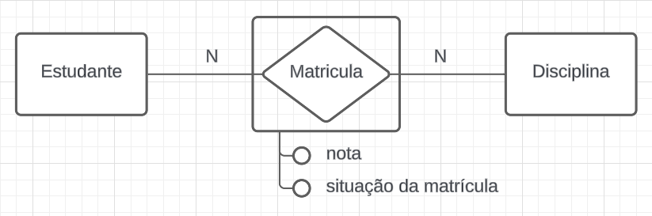

# Modelo Entidade-Relacionamento e Diagrama de Entidade-Relacionamento

## Modelo Entidade-Relacionamento (MER)

O **Modelo Entidade-Relacionamento (ER)** é uma técnica de modelagem que ajuda a representar a estrutura de um banco de dados de forma visual. Ele descreve como os dados estão relacionados entre si e facilita o planejamento de sistemas que irão trabalhar com esses dados. 

## Diagrama Entidade-Relacionamento (DER)
O **Diagrama Entidade-Relacionamento (DER)** é a representação gráfica do modelo ER. Ele facilita a visualização das entidades, seus atributos e os relacionamentos entre elas.

## Componentes de um MER e DER:

### **Entidades**: 
  As entidades são os objetos principais que serão armazenados no banco de dados. Elas representam as tabelas do nosso banco de dados. Por exempo: uma entidade chamada "Cliente" se tornará uma tabela "Cliente" onde os atributos serão as colunas dessa tabela. 

|  | Cliente |
| :--: | :--: |
| **ID** | 1 |
| **Nome** | Ana |
| **Email** | ana@email.com |
| **CPF** | 123.456.789-00 |
  
  #### Dicas:
    
  > *Uma boa prática é usar nomes no singular para representar entidades e com letra maiúscula no início, por exemplo, "Cliente" em vez de "Clientes" ou "cliente".*
  
  #### Representação Visual no DER:
  As entidades são representadas por retângulos com o nome da entidade no topo ou dentro do retângulo.

| 

Os principais tipos de entidades são:

#### **1. Entidades Fortes**:
- **Descrição**: São entidades independentes que possuem uma chave primária própria (um id, ou algo para identificar aquela unidade. Abordaremos a seguir). Elas podem existir sem a dependência de outras entidades.
- **Exemplo**: Um **Funcionário** possui filhos, que são seus dependentes. A empresa precisa saber disso para questões de benefícios, por exemplo. O funcionário é uma entidade forte, pois deve existir tendo dependentes ou não. Já os dependentes são entidades fracas, pois dependem de um funcionário para existir.
  
  #### Dicas:
  - **Pergunta-chave**: "Essa entidade pode/deve existir sozinha?" Se a resposta for "sim", então ela é uma entidade forte.
  - **Exemplo prático**: Em um jogo de RPG, um **Personagem** é uma entidade forte, pois pode existir sem depender de nenhum outro objeto.

#### Representação Visual no DER:
- **Entidades Fortes** são representadas por retângulos com o nome da entidade no topo ou dentro do retângulo.
  
|  |

#### **2. Entidades Fracas**:
- **Descrição**: São entidades que **não possuem chave primária própria** e dependem de uma entidade forte para sua existência e identificação. Elas são identificadas por meio da chave estrangeira da entidade forte à qual estão associadas, além de um identificador parcial (um atributo adicional que distingue as instâncias da entidade fraca).
- **Exemplo**: Um **Dependente** de um funcionário em uma empresa. O dependente só pode existir se houver um funcionário associado, e a chave primária do dependente será composta pela chave estrangeira do funcionário e um atributo adicional, como o nome ou cpf do dependente.

  #### Dicas:
  - **Pergunta-chave**: "Essa entidade pode/deve existir sozinha?" Se a resposta for "não", então ela é uma entidade fraca.
  - **Exemplo prático**: Um em jogo o seu personagem tem uma **Mochila**, caso ela não possa existir sem o personagem, ela é uma entidade fraca. Claro, existem jogos que permitem a existência de mochilas sem personagens. Então a escolha de qual entidade é forte ou fraca depende do projeto e da necessidade.

  > *Entidades fracas são úteis para modelar objetos que não podem ser descritos adequadamente de forma independente. Por exemplo, dependentes de funcionários, itens de pedidos, etc.*

#### Representação Visual no DER:
- **Entidades Fracas** são representadas por retângulos com bordas duplas, com o nome da entidade no topo ou dentro do retângulo.

|  |

#### Demais tipos de entidades:
Existem também as **entidades associativas**, **entidades especializadas** e **entidades generalizadas**. Elas serão abordadas em detalhes em seções posteriores, pois são conceitos mais avançados e específicos.

---

### **Atributos**:

Os atributos são as características ou propriedades de uma entidade. Em grande parte das vezes, a escolha de qual atributo usar vai depender da escolha da pessoa que planejou do banco de dados, não tendo uma regra rígida para isso. Um nome completo, por exemplo, pode ser armazenado como um atributo simples, caso o projetista deseje armazena-lo assim. Porém também pode ser armazenado como um atributo composto, dividindo-o em nome e sobrenome. 

> Uma boa prática é usar nomes de atributos no singular e com letra minúscula, por exemplo, "nome" em vez de "nomes" ou "Nomes".

Os atributos podem ser classificados em quatro tipos principais:

#### 1. Atributos Simples
Essa opção de atributo deve ser escolhida quando se deseja armazenar informações que não serão divididas. 
- **Exemplo**: 
  - **Nome** de uma pessoa, onde o valor seria apenas "Ana".
  - **Email** de um usuário, como "ana@email.com".
  - **CPF** de um indivíduo, como "123.456.789-00".
  - **Senha** de um usuário, como "senha123".
  
    > *Atributos simples são usados para armazenar informações que não precisam ser divididas em partes menores.*

    #### Representação Visual no DER:
    Os atributos simples são representados por elípses ou circlos conectados às entidades, onde o nome pode ser colocado dentro da elipse ou ao lado do círculo.

    

#### 2. Atributos Compostos
Atributos compostos são aqueles que podem ser divididos em subpartes. Eles são úteis quando um dado tem várias partes, como um endereço (rua, cidade, CEP) ou um nome completo (nome, sobrenome).

- **Exemplo**: 
  - **Endereço**, que pode ser dividido em:
    - **Rua**: "Avenida Paulista"
    - **Cidade**: "São Paulo"
    - **CEP**: "01311-000"
  - **Nome Completo**, que pode ser dividido em **Nome** e **Sobrenome**.
  
    > *Deve se tomar cuidado no uso de atributos compostos. Na prática, os eles só aparecem na representação visual do modelo de dados. Para o banco de dados, eles são tratados como vários atributos simples ( o atributos composto endereço vira 3 atributos simples: rua, cidade e CEP), ou, em alguns casos, pode ser criada uma tabela separada para armazenar esses dados.*

    #### Representação Visual no DER:
    Atributos compostos são representados por uma elipse maior conectada a subelipses que indicam os subatributos. As linhas entre a elipse principal e os subatributos mostram sua composição.

    

#### 3. Atributos Multivalorados
Esse tipo de atributo é usado quando há a necessidade de armazenar múltiplos dados do mesmo tipo para uma entidade, como números de telefone ou e-mails.

- **Exemplo**:
  - **Telefones** de um cliente, onde uma pessoa pode ter mais de um número, como "9999-1111" e "8888-2222".
  - **E-mails** de um usuário, onde um cliente pode ter mais de um endereço de e-mail, como "exemplo1@gmail.com" e "exemplo2@hotmail.com".
  
    > Deve-se ter cuidado ao modelar atributos multivalorados. Na prática, em vez de armazenar vários valores em um único campo, na maioria das vezes o atributo multivalorado tratado com uma **tabela separada**. Por exemplo, se um cliente pode ter múltiplos números de telefone, criamos uma tabela "Telefones" que armazena cada número de telefone separadamente, ligado à entidade original (Cliente) através de uma chave estrangeira. Isso permite um gerenciamento mais eficiente e evita redundância de dados.*

    #### Representação Visual no DER:
    Atributos multivalorados são representados por elipses com bordas duplas. Isso indica que o atributo pode conter mais de um valor.
    

#### 4. Atributos Derivados
Atributos derivados são calculados a partir de outros atributos existentes no banco de dados. Eles não são armazenados diretamente, mas são gerados dinamicamente conforme a necessidade. Isso evita redundância e mantém a integridade dos dados.
- **Exemplo**:
  - **Idade** de uma pessoa, que pode ser derivada da **Data de Nascimento**.
  - **Duração de Emprego**, que pode ser calculada a partir da **Data de Contratação** e da data atual.
  
    > *Na prática, eles não são armazenados fisicamente, então não existem na tabela.

    #### Representação Visual no DER:
    Atributos derivados são representados por elipses com bordas tracejadas, indicando que o valor não é armazenado, mas calculado a partir de outros atributos.
    

---

### **Chaves**:

As **chaves** são componentes fundamentais em um banco de dados, utilizadas para identificar de maneira única cada linha (tupla) dentro de uma tabela e garantir a integridade dos dados. Cada tipo de chave tem um propósito específico, seja para identificar registros, conectar diferentes tabelas ou acelerar consultas.

#### **Tipos de Chaves**:

#### **1. Chave Primária (Primary Key)**:
 A **chave primária** é um atributo ou conjunto de atributos que identifica de forma **única** cada registro em uma tabela. Ela não pode conter valores nulos e não pode haver duplicatas.

#### Exemplo prático:
Na tabela **Clientes**, o atributo **ID_Cliente** seria a chave primária, garantindo que cada cliente tenha um ID único para representa-lo. Pode ser que uma pessoa tenha o mesmo nome de outra, a mesma idade, mas o ID_Cliente será único para cada cliente.

| Cliente |  
|---------|  
| **ID_Cliente** (PK) | Nome | CPF |  
| 1        | Ana  | 123.456.789-00 |  

**Dica:** 
> Sempre use atributos que sejam garantidos como únicos (exemplo: **ID**, **CPF**, **CNPJ**) e que não possam ser alterados ao longo do tempo.
  
#### Representação Visual no DER:
A chave primária é sublinhada no DER, indicando que é a chave principal que identifica cada registro de forma única. Outra forma de representar a chave é colocando um circulo preto preenchido ao lado do atributo. 

#### **2. Chave Estrangeira (Foreign Key)**:
Uma **chave estrangeira** é um atributo que estabelece uma ligação entre duas tabelas, referenciando a **chave primária** de outra tabela. Isso permite que as tabelas compartilhem dados entre si de forma consistente.

#### Exemplo prático:
Em uma tabela de **Pedidos**, o campo **ID_Cliente** seria uma chave estrangeira que aponta para o **ID_Cliente** da tabela **Clientes**, estabelecendo a relação entre os pedidos e os clientes que os fizeram.

| Pedidos |  
|---------|  
| **ID_Pedido** (PK) | ID_Cliente (FK) | Produto |  
| 101       | 1               | Laptop  |  

#### Representação Visual no DER:
As cjaves estrangeiras não são explicitamente representadas no DER. Elas representam o relacionamento entre as tabelas e são usadas para criar conexões entre os registros. Ou seja, na representação do DER será visto relacionamentos entre as tabelas, e não as chaves estrangeiras em si.

#### **3. Chave Candidata (Candidate Key)**:
Uma **chave candidata** é qualquer atributo ou conjunto de atributos que poderia ser escolhido como chave primária, pois também identifica de forma única cada tupla na tabela. Uma tabela pode ter várias chaves candidatas, mas apenas uma será escolhida como chave primária.

#### Exemplo prático:
Em uma tabela de **Funcionários**, tanto o **CPF** quanto o **ID_Funcionário** podem ser chaves candidatas, pois ambos são únicos para cada funcionário.

| Funcionários |  
|--------------|  
| **ID_Funcionário** (PK) | CPF (CK) | Nome |  
| 001          | 123.456.789-00 | Maria |  

#### **Dica**:
> Identifique possíveis chaves candidatas que sejam únicas e não nulas, mas escolha a chave primária que melhor represente a entidade e não mude com frequência.

#### Representação Visual no DER:
- No DER, a única chave candidata que é sublinhada é a chave escolhida como primária. As demais chaves candidatas são representadas da mesma forma que os atributos normais.

#### **4. Chave Composta (Composite Key)**:
Uma **chave composta** é formada por dois ou mais atributos que, juntos, identificam de forma única uma tupla. Nenhum dos atributos, individualmente, pode garantir a unicidade, mas a combinação deles pode.

#### Exemplo prático:
Em uma tabela chamada de **Matrícula**, que representa a matricula do aluno em uma disciplina, a combinação de **ID_Aluno** e **ID_Disciplina** forma uma chave composta, garantindo que o aluno só possa se matricular uma vez em cada disciplina.

| Matrícula |  
|-----------|  
| **ID_Aluno** (PK) | **ID_Disciplina** (PK) | Data de Matrícula |  
| 101           | 202          | 01/02/2024 |  

#### Representação Visual no DER:
Para representar uma chave composta no DER, basta sublinhar todos os atributos que formam a chave, indicando que juntos eles identificam de forma única uma tupla.

|  |

#### **5. Chave Alternativa (Alternate Key)**:
Uma **chave alternativa** é qualquer chave candidata que não foi escolhida como chave primária. Ela pode ser usada para identificar registros, mas não é a chave principal.

#### Exemplo prático:
Na tabela **Clientes**, o **CPF** pode ser uma chave alternativa, já que **ID_Cliente** foi escolhido como chave primária.

| Cliente |  
|---------|  
| **ID_Cliente** (PK) | CPF (AK) | Nome |  
| 1        | 123.456.789-00 | Ana  |  

#### Representação Visual no DER:
Não são feitas distinções visuais específicas para chaves alternativas no DER. Elas são tratadas como atributos normais.

#### **6. Chave Secundária (Secondary Key)**:
Uma **chave secundária** é usada para criar índices em um banco de dados e acelerar a busca de dados. Ela não é única e não é a chave primária, mas é útil para consultas frequentes.

#### Exemplo prático:
O campo **Email** de uma tabela **Clientes** pode ser usado como chave secundária para acelerar buscas por email.

| Cliente |  
|---------|  
| **ID_Cliente** (PK) | Email (SK) | Nome |  
| 1        | ana@email.com  | Ana  |  

#### **Dica**:
> Use chaves secundárias para otimizar consultas de atributos que são pesquisados frequentemente, como **email** ou **número de telefone**.

#### Representação Visual no DER:
- Não há uma representação específica para chaves secundárias no DER.

#### **7. Chave Super (Super Key)**:
Uma **super chave** é qualquer conjunto de atributos que identifica de forma única uma tupla em uma tabela. Toda chave primária é uma super chave, mas nem toda super chave é uma chave primária, pois pode conter atributos extras.

#### Exemplo prático:
Na tabela **Cliente**, a combinação de **ID_Cliente** e **CPF** seria uma super chave, mesmo que apenas **ID_Cliente** já seja suficiente para identificar o cliente.

| Cliente |  
|---------|  
| **ID_Cliente** (PK) | CPF | Nome |  
| 1        | 123.456.789-00 | Ana  |

#### **Dica**:
> Não use super chaves com atributos desnecessários, já que chaves simples são mais eficientes e menos sujeitas a mudanças.

#### Representação Visual no DER:
- Super chaves não são explicitamente representadas no DER. Elas são um conceito que engloba qualquer combinação de atributos que seja única.

---

### **Relacionamentos**

Os relacionamentos definem as interações entre as entidades. Nossos exemplos mostrarão cardinalidades, porém, não se precupe em entende-las por agora. As cardinalidades serão abordadas em seções posteriores.

#### Relacionamento Binário: 
  - Envolve **duas** entidades. Por exemplo, o relacionamento entre **Cliente** e **Pedido**, onde um cliente pode fazer vários pedidos e um pedido é feito por um único cliente.
  - **Exemplo prático**: Um **Cliente** faz um ou N **Pedido**.
    - Cliente (1:N) Pedido

    #### Representação Visual no DER:
    Relacionamentos binários são representados por losangos conectados às entidades participantes. As linhas que conectam as entidades ao relacionamento indicam a participação das entidades no relacionamento.
    

    > Na prática, grande parte dos relacionamentos binários não são armazenados diretamente no banco de dados. Em vez disso, eles são conectados por atributos com **chaves estrangeiras**. Por exemplo, em um relacionamento entre **Cliente** e **Pedido**, a tabela de **Pedidos** teria uma chave estrangeira que referencia o **ID** do **Cliente** que fez o pedido. Não haveria outra tabela com o nome **Faz**. Porém existem casos em que é necessário criar uma tabela intermediária. Falaremos sobre isso em **Cardinalidades**.

#### Relacionamento Ternário:
  - Envolve **três** entidades. Relacionamentos ternários são utilizados quando três entidades precisam se relacionar diretamente, sem a necessidade de dividir o relacionamento em vários binários.
  - **Exemplo prático**:  Imagine o relacionamento entre **Médico**, **Paciente**, e **Hospital**. Um médico pode atender vários pacientes, em vários hospitais diferentes. Da mesma forma, o paciente pode ser atendido por vários médicos, mas esse atendimento também depende do hospital onde o médico trabalha. O relacionamento ternário resolve essa interação diretamente:
    - Médico (1) Paciente (N) Hospital.

  #### Representação Visual no DER:
  Relacionamentos ternários são representados por um losango conectado a três entidades. As linhas conectam cada entidade ao relacionamento e indicam como elas participam no relacionamento.
  
  

  > Na prática, relacionamentos ternários não podem ser armazenados diretamente em um banco de dados relacional. Por isso há algumas formas de resolver esse tipo de relacionamento.

  **Formas comuns de resolver relacionamentos ternários no Banco de Dados:**

  1. **Criação de uma Tabela Associativa ou de uma Entidade Associativa**: 
     - A Tabela Associativa conterá as **chaves estrangeiras** das três entidades envolvidas no relacionamento. Cada chave estrangeira apontará para a chave primária de uma das entidades. 
     - A tabela associativa terá sua própria chave primária composta pelas três chaves estrangeiras, ou você pode definir uma chave primária própria.
     - Caso exista novos atributos relacionados ao relacionamento, eles podem ser armazenados na tabela associativa.
     
     **Exemplo**: Para o relacionamento entre **Médico**, **Paciente**, e **Hospital**, criamos uma tabela **Atendimento**, que incluirá as colunas:
     - `id_medico` (chave estrangeira para a tabela **Médico**)
     - `id_paciente` (chave estrangeira para a tabela **Paciente**)
     - `id_hospital` (chave estrangeira para a tabela **Hospital**)
     - Caso seja necessário utilizar atributos adicionais, como *data do atendimento*, *diagnóstico*, *plano de saúde*, etc., então podemos substituír o relacionamento ternário por uma **Entidade Associativa**.

   Problema resolvido com uma **Tabela Associativa**:

  

#### **Relacionamento n-ário**:
   Um relacionamento **n-ário** envolve **mais de três entidades**. Este tipo de relacionamento é útil em cenários complexos, onde várias entidades precisam interagir. Ele conecta múltiplas entidades de forma direta. Em um relacionamento n-ário, a interdependência das entidades requer que todas estejam relacionadas ao mesmo tempo, ou seja, o relacionamento entre elas só faz sentido no contexto de todas as entidades envolvidas.
  
  - **Exemplo prático**: Imagine a gestão de um **Projeto** que requer a participação de várias entidades, como **Gerente**, **Funcionários**, e **Recursos**. Nesse cenário, um projeto pode ser gerenciado por um gerente, utilizar vários recursos, e envolver vários funcionários. Aqui, as quatro entidades precisam estar relacionadas de forma conjunta para capturar todas as informações necessárias. 
    - **Projeto** (1:N) **Gerente** (N:M) **Funcionário** (N:M) **Recurso**
    
    Isso significa que:
    - Um **Gerente** pode gerenciar vários projetos.
    - Um **Funcionário** pode estar envolvido em vários projetos.
    - Vários **Recursos** podem ser utilizados por um projeto e pelos funcionários envolvidos.

  #### Representação Visual no DER:
  Relacionamentos n-ários são representados por um **losango central** que conecta quatro ou mais entidades. Cada linha que conecta uma entidade ao relacionamento representa a participação dessa entidade no relacionamento. No diagrama, os relacionamentos n-ários indicam como essas entidades interagem de maneira interdependente.

  #### Implementação no Banco de Dados:
  Na prática, **relacionamentos n-ários** são geralmente resolvidos com **tabelas associativas**. Cada tabela associativa armazena as **chaves estrangeiras** das entidades relacionadas e pode conter atributos adicionais que descrevem a interação entre essas entidades. Por exemplo, no caso do projeto:
  - Uma tabela associativa poderia armazenar as chaves de **Projeto**, **Gerente**, **Funcionário**, e **Recurso**. 
  - A tabela também poderia ser substituida por uma **Entidade Associativa** e incluir informações adicionais, como **horas trabalhadas** pelos funcionários ou **custo de recursos**.

  **Formas de Resolver Relacionamentos n-ários**:
  1. **Tabelas Associativas**: A forma mais comum de resolver relacionamentos n-ários no banco de dados é criar várias tabelas associativas que conectam as entidades de forma eficiente. Cada tabela associativa conterá as chaves estrangeiras das entidades envolvidas.
  2. **Divisão em Relacionamentos Menores**: Às vezes, pode ser útil dividir o relacionamento n-ário em uma série de relacionamentos menores (binários ou ternários) para simplificar a modelagem.

  > **Observação**: Embora relacionamentos n-ários possam ser representados visualmente no **DER**, sua implementação no banco de dados exige um planejamento cuidadoso para garantir a integridade e eficiência da modelagem. O uso de tabelas associativas é essencial para resolver as conexões entre as múltiplas entidades envolvidas.

---

### **Entidade Associativa**

As **entidades associativas**, também conhecidas como **Entidades de Relacionamento**, surgem para representar relacionamentos **N:M** (muitos para muitos) entre duas ou mais entidades. Elas são necessárias quando há um relacionamento complexo entre as entidades, que precisa ser resolvido de maneira eficiente no banco de dados. Ao criar uma entidade associativa, o relacionamento **N:M** é transformado em dois relacionamentos **1:N**, tornando o banco de dados mais organizado e normalizado.

#### **Características principais**:
- **Dependência das Entidades Associadas**: A entidade associativa **não existe de forma independente** sem as entidades que estão sendo relacionadas. Ela só faz sentido no contexto do relacionamento entre essas entidades.
  
- **Chaves Estrangeiras**: A entidade associativa contém as **chaves estrangeiras** das entidades que está conectando. Essas chaves estrangeiras garantem a integridade referencial e vinculam a entidade associativa às entidades principais.

- **Atributos Próprios**: Além das chaves estrangeiras, a entidade associativa pode ter **atributos próprios** que fornecem informações adicionais sobre o relacionamento. Esses atributos capturam detalhes específicos que não pertencem diretamente às entidades individuais, mas ao relacionamento entre elas. Por exemplo, em um relacionamento entre **alunos** e **disciplinas**, a entidade associativa **Matrícula** pode incluir atributos como **data de matrícula**, **nota** e **status da inscrição**.

- **Chave Primária**: A entidade associativa pode ter uma **chave primária composta** pelas chaves estrangeiras das entidades relacionadas, ou uma chave primária própria, gerada para identificá-la de forma única.

#### **Exemplo de Entidade Associativa**:
Imagine o relacionamento entre **Alunos** e **Disciplinas** em uma universidade. Um aluno pode se inscrever em várias disciplinas, e uma disciplina pode ser cursada por vários alunos. Esse é um clássico relacionamento **N:M**, onde um aluno pode cursar várias disciplinas, e cada disciplina pode ter múltiplos alunos.

Para resolver esse relacionamento no banco de dados, é criada uma **entidade associativa** chamada **Matrícula**. A entidade **Matrícula** contém:

- **id_aluno** (chave estrangeira que referencia a entidade **Aluno**)
- **id_disciplina** (chave estrangeira que referencia a entidade **Disciplina**)
- **Atributos próprios** como **data de matrícula**, **nota**, e **situação da matrícula** (aprovado, reprovado, cursando, etc.)

#### Representação Visual no DER:
Entidades associativas são representadas por retângulos com o nome da entidade no topo ou dentro do retângulo. Elas são conectadas às entidades principais por linhas que indicam o relacionamento.

Essa abordagem resolve o relacionamento **N:M** entre **Alunos** e **Disciplinas**, criando dois relacionamentos **1:N**, onde um aluno pode ter várias matrículas e uma disciplina pode ter várias matrículas associadas.

#### **Vantagens**:
- **Organização e Flexibilidade**: A entidade associativa permite modelar relacionamentos complexos com flexibilidade, adicionando atributos que descrevem o relacionamento de forma mais completa.
- **Integridade e Normalização**: Ao separar o relacionamento em duas partes (N:M para 1:N), a integridade dos dados é preservada e o banco de dados se mantém normalizado, evitando duplicação de dados e redundâncias.

---

### **Cardinalidades**: 
  - Definem como as entidades participam dos relacionamentos:
    - **1:1**: Uma entidade A está relacionada a no máximo uma entidade B.
    - **1:N**: Uma entidade A está relacionada a várias entidades B.
    - **N:M**: Várias entidades A estão relacionadas a várias entidades B.

- **Agregação**: 
  - Agrupa relacionamentos complexos, tratando-os como uma entidade, o que simplifica a visualização de interações complexas.

- **Especialização e Generalização**: 
  - **Especialização**: Detalha uma entidade genérica em entidades mais específicas (ex.: funcionário pode se especializar em gerente ou técnico).
  - **Generalização**: Agrupa várias entidades específicas em uma entidade genérica (ex.: carro e moto podem ser generalizados como veículo).

